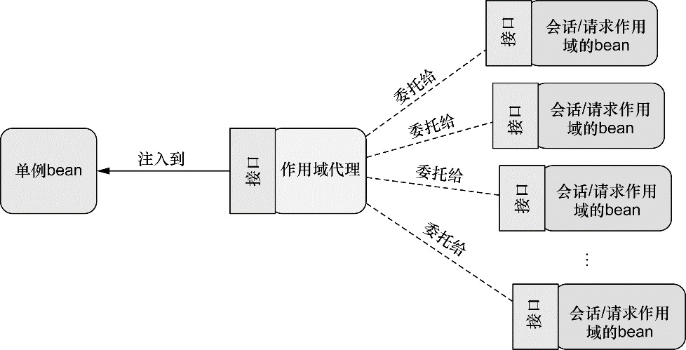

###Chapter 3 : 高级装配  
:bangbang: [这一章的内容以前没太接触过]()
####1. _Spring Profile_  

开发软件的一个最大的挑战之一就是从开发换件到其他环境的切换. 经常, 在开发环境可以很好运行的软件, 到其他环境就不能使用了. 数据库配置, 加密算法和外部系统的继承只是总舵可能会改变整个部署环境的事情中的一个.   

比如配置DatsSource, 一种解决方案是将不同的DataSource放在不同的配置文件中, 然后使用maven的profile在编译器决定何时使用哪一种配置方式. 这个问题是, 它需要应用程序去重新编译每一个环境. 对于从开发到QA, 重新编译不是一个大的问题. 但是, 在QA到生成环境中要求一个重新编译可能会引入一些BUG, 从而导致QA团队的困难.   

Spring3.1以后提供了一种不需要重新构建的解决方案, Spring会在运行时再根据环境决定每个bean的创建与否, 这使得同一个部署单元可以适用于所有的环境!!

+ 配置profile bean:
    + 在JavaConfig中, 你可以使用@Profile注解去标明一个Bean属于哪个profile. 比如, 上面的DataSource可能像下面这样定义.  
    ```java
    import org.springframework.context.annotation.Bean;
    import org.springframework.context.annotation.Configuration;
    import org.springframework.context.annotation.Profile;
    import org.springframework.jdbc.datasource.embedded.EmbeddedDatabaseBuilder;
    import org.springframework.jdbc.datasource.embedded.EmbeddedDatabaseType;
    import javax.sql.DataSource;
  
    @Configuration
    // 我需要你注意的最重要的事情就是, @Profile注解是作用于类的. 它告诉Spring, 该类的所有Bean只有在 
    // dev profile中才会被激活. 如果dev profile没有被激活, 则该类下面的Bean会被忽略. 
    @Profile("dev")
    public class DevelopmentProfileConfig {
        @Bean(destroyMethod = "shutdown")
        public DataSource dataSource() {
            return new EmbeddedDatabaseBuilder()
                    .setType(EmbeddedDatabaseType.H2)
                    .addScript("classpath:schema.sql")
                    .addScript("classpath:test-data.sql")
                    .build();
        }
    }
    ```

    同时, 你可能有另外的生成环境配置文件类. 如下:   
    ```java
    import org.springframework.context.annotation.Bean;
    import org.springframework.context.annotation.Configuration;
    import org.springframework.context.annotation.Profile;
    import org.springframework.jndi.JndiObjectFactoryBean;
    import javax.sql.DataSource;
    
    @Configuration
    //在这里, bean不会被创建, 除非prod profile激活. 
    @Profile("prod")
    public class ProductionProfileConfig {
        @Bean
        public DataSource dataSource() {
            JndiObjectFactoryBean jndiObjectFactoryBean =
                    new JndiObjectFactoryBean();
            jndiObjectFactoryBean.setJndiName("jdbc/myDS");
            jndiObjectFactoryBean.setResourceRef(true);
            jndiObjectFactoryBean.setProxyInterface(
                    javax.sql.DataSource.class);
            return (DataSource) jndiObjectFactoryBean.getObject();
        }
    }
    ```
    
    [上面两段配置类中的bean只有在对应的Profile文件被激活才会分别被创建!这是类级别的.]()  
    [但是Spring3.2开始, 可以将 **@profile** 应用在方法级别. 这个特性使得将所有Bean定义组合到一个文件中成为可能.]()  
    将上面两个配置类整合为一个:  
    ```java
    import org.springframework.context.annotation.Bean;
    import org.springframework.context.annotation.Configuration;
    import org.springframework.context.annotation.Profile;
    import org.springframework.jdbc.datasource.embedded.EmbeddedDatabaseBuilder;
    import org.springframework.jdbc.datasource.embedded.EmbeddedDatabaseType;
    import org.springframework.jndi.JndiObjectFactoryBean;
    import javax.sql.DataSource;
    
    @Configuration
    public class DataSourceConfig {
        @Bean(destroyMethod = "shutdown")
        //对应名称为dev的profile
        @Profile("dev")
        public DataSource embeddedDataSource() {
            return new EmbeddedDatabaseBuilder()
                    .setType(EmbeddedDatabaseType.H2)
                    .addScript("classpath:schema.sql")
                    .addScript("classpath:test-data.sql")
                    .build();
        }
    
        @Bean
        //对应名称为prod的profile
        @Profile("prod")
        public DataSource jndiDataSource() {
            JndiObjectFactoryBean jndiObjectFactoryBean =
                    new JndiObjectFactoryBean();
            jndiObjectFactoryBean.setJndiName("jdbc/myDS");
            jndiObjectFactoryBean.setResourceRef(true);
            jndiObjectFactoryBean.setProxyInterface(javax.sql.DataSource.class);
            return (DataSource) jndiObjectFactoryBean.getObject();
        }
    }
    ```
    
    [对于没有显示声明@Profile的方法或者配置类, 其相应的bean则默认始终创建.]() :bangbang:  
    Spring同样 **支持** 通过xml配置文件配置Profile, 当然也支持在一个XML中配置多个属于不同Profile的bean.
  
    ```xml
    <!--多个Profile-->
    <?xml version="1.0" encoding="UTF-8"?>
    <beans xmlns="http://www.springframework.org/schema/beans"
    xmlns:xsi="http://www.w3.org/2001/XMLSchema-instance"
    xmlns:jdbc="http://www.springframework.org/schema/jdbc"
    xsi:schemaLocation="http://www.springframework.org/schema/jdbc
    http://www.springframework.org/schema/jdbc/spring-jdbc.xsd
    http://www.springframework.org/schema/beans
    http://www.springframework.org/schema/beans/spring-beans.xsd"
    profile="dev">
        <jdbc:embedded-database id="dataSource">
            <jdbc:script location="classpath:schema.sql" />
            <jdbc:script location="classpath:test-data.sql" />
        </jdbc:embedded-database>
    </beans>
    ```
    
    ```xml
    <!--多个Profile-->
    <?xml version="1.0" encoding="UTF-8"?>
    <beans xmlns="http://www.springframework.org/schema/beans"
    xmlns:xsi="http://www.w3.org/2001/XMLSchema-instance"
    xmlns:jdbc="http://www.springframework.org/schema/jdbc"
    xmlns:jee="http://www.springframework.org/schema/jee"
    xmlns:p="http://www.springframework.org/schema/p"
    xsi:schemaLocation="
    http://www.springframework.org/schema/jee
    http://www.springframework.org/schema/jee/spring-jee.xsd
    http://www.springframework.org/schema/jdbc
    http://www.springframework.org/schema/jdbc/spring-jdbc.xsd
    http://www.springframework.org/schema/beans
    http://www.springframework.org/schema/beans/spring-beans.xsd">
        <beans profile="dev">
            <jdbc:embedded-database id="dataSource">
                <jdbc:script location="classpath:schema.sql" />
                <jdbc:script location="classpath:test-data.sql" />
            </jdbc:embedded-database>
        </beans>
        <beans profile="qa">
            <bean id="dataSource"
            class="org.apache.commons.dbcp.BasicDataSource"
            destroy-method="close"
            p:url="jdbc:h2:tcp://dbserver/~/test"
            p:driverClassName="org.h2.Driver"
            p:username="sa"
            p:password="password"
            p:initialSize="20"
            p:maxActive="30" />
        </beans>
        <beans profile="prod">
            <jee:jndi-lookup id="dataSource"
            jndi-name="jdbc/myDatabase"
            resource-ref="true"
            proxy-interface="javax.sql.DataSource" />
        </beans>
    </beans>
    ```
    
    这个就是JavaConfig一样, 只有在特定的profile被激活的时候, 该Bean才会被创建.  
    
+ 激活Profile  
Spring在确定哪个profile处于激活状态时, 需要依赖两个独立的属性: [spring.profiles.active]()和[spring.profiles.default]().   
**Step 1** 如果设置了spring.profiles.active属性的话, 那么它的值就会用来确定哪个profile是激活的.   
**Step 2** 但如果没有设置spring.profiles.active属性的话, 那Spring将会查找spring.profiles.default的值.   
**Step 3** 如果spring.profiles.active和spring.profiles.default均没有设置的话, 那就没有激活的profile, 因此**只会创建那些没有定义在profile中的bean**.   
    
[有多重方式来设置这两个属性:]()
    + 作为DispatcherServlet的初始化参数;
    + 作为Web应用的上下文参数;
    + 作为JNDI条目;
    + 作为环境变量;
    + 作为JVM的系统属性;
    + 在集成测试类上, 使用@ActiveProfiles注解设置;
        
作者推荐在Web开发中使用DispatcherServlet的参数将spring.profile.default设置为开发环境的profile, [同时在Servlet上下文进行设置, 主要是为了兼顾到ContextLoaderListener.]()  
```xml
<?xml version="1.0" encoding="UTF-8"?>
<web-app version="2.5"
  xmlns="http://java.sun.com/xml/ns/javaee"
  xmlns:xsi="http://www.w3.org/2001/XMLSchema-instance"
  xsi:schemaLocation="http://java.sun.com/xml/ns/javaee
  http://java.sun.com/xml/ns/javaee/web-app_2_5.xsd">
    <context-param>
      <param-name>contextConfigLocation</param-name>
      <param-value>/WEB-INF/spring/root-context.xml</param-value>
    </context-param>
  <context-param>
    <param-name>spring.profiles.default</param-name>
    <param-value>dev</param-value>
    </context-param>
  <listener>
      <listener-class>
          org.springframework.web.context.ContextLoaderListener
      </listener-class>
  </listener>
  <servlet>
      <servlet-name>appServlet</servlet-name>
      <servlet-class>
           org.springframework.web.servlet.DispatcherServlet
      </servlet-class>
      <init-param>
          <param-name>spring.profiles.default</param-name>
          <param-value>dev</param-value>
      </init-param>
      <load-on-startup>1</load-on-startup>
  </servlet>
  <servlet-mapping>
  <servlet-name>appServlet</servlet-name>
  <url-pattern>/</url-pattern>
  </servlet-mapping>
</web-app>
```

当更换应用程序部署环境时, 负责部署的人根据情况使用系统属性, 环境变量或JNDI设置spring.profiles.active即可. 当设置spring.profiles.active以后, 至于spring.profiles.default置成什么值就已经无所谓了;系统会优先使用spring.profiles.active中所设置的profile.    
     
+ 使用profile进行测试  :bangbang:
当运行集成测试时, 通常会希望采用与生产环境（或者是生产环境的部分子集）相同的配置进行测试. 
但是, 如果配置中的bean定义在了profile中, 那么在运行测试时, 我们就需要有一种方式来启用合适的profile. 
Spring提供了@ActiveProfiles注解, 我们可以使用它来指定运行测试时要激活哪个profile. 在集成测试时, 通常想要激活的是开发环境的profile. 例如, 下面的测试类片段展现了使用@ActiveProfiles激活dev profile.   
    
    ```java
    @RunWith(SpringJUnit4ClassRunner.class)
    @ContextConfiguration(classes={PersistenceTestConfig.class})
    @ActiveProfiles("dev")
    public class PersistenceTest {
    ...
    }
    ```
    
####2. [_条件化的bean声明_]() :bangbang:
条件化的bean声明可以满足一些复杂的需求, 这个是Spring4.0后提供的.   
+ [@Conditional]()注解可以用到带有@Bean注解的方法上如果给定的条件计算结果为true, 就会创建这个bean, 否则的话, 这个bean会被忽略.   
    比如下面, @Conditional中给定了一个MagicExistsCondition, 该类会进行条件判断, 并返回boolean值.  
    ```java
    @Bean
    //条件判断
    @Conditional(MagicExistsCondition.class)
    public MagicBean magicBean() {
      return new MagicBean();
    }
    ```
    
    ```java
    import org.springframework.context.annotation.Condition;
    import org.springframework.context.annotation.ConditionContext;
    import org.springframework.core.type.AnnotatedTypeMetadata;
    import org.springframework.util.ClassUtils;
    public class MagicExistsCondition implements Condition {
      public boolean matches(
          ConditionContext context, AnnotatedTypeMetadata metadata) {
          
          Environment env = context.getEnvironment();
          return env.containsProperty("magic");
      }
    }
    ```
    
+ 设置给@Conditional的类可以是任意实现了 **Condition** 接口的类型. 这个接口实现起来很简单直接, 只需提供matches()方法. 如果matches()方法返回true, 那么就会创建带有@Conditional注解的bean. 如果matches()方法返回false, 将不会创建这些bean.   
    ```java
    public interface Condition {
      boolean matches(ConditionContext ctxt,
                      AnnotatedTypeMetadata metadata);
    }
    ```
    
+ ConditionContext接口: 具体用法看我下面注释
    ```java
    public interface ConditionContext {
    
      //借助getRegistry()返回的BeanDefinitionRegistry检查bean定义
      BeanDefinitionRegistry getRegistry();
    
      //借助getBeanFactory()返回的ConfigurableListableBeanFactory检查bean是否存在, 甚至探查bean的属性
      ConfigurableListableBeanFactory getBeanFactory();
    
      //借助getEnvironment()返回的Environment检查环境变量是否存在以及它的值是什么;
      Environment getEnvironment();
    
      //读取并探查getResourceLoader()返回的ResourceLoader所加载的资源;
      ResourceLoader getResourceLoader();
    
      //借助getClassLoader()返回的ClassLoader加载并检查类是否存在. 
      ClassLoader getClassLoader();
    }
    ```

+ AnnotatedTypeMetadata接口: 具体用法看我下面注释
    ```java
    public interface AnnotatedTypeMetadata {
      
      //判断带有@Bean注解的方法是不是还有其他特定的注解
      boolean isAnnotated(String annotationType);
    
      //一下方法用于检查@Bean注解的方法上其他注解的属性. 
      Map<String, Object> getAnnotationAttributes(String annotationType);
      Map<String, Object> getAnnotationAttributes(
      String annotationType, boolean classValuesAsString);
      MultiValueMap<String, Object> getAllAnnotationAttributes(
      String annotationType);
      MultiValueMap<String, Object> getAllAnnotationAttributes(
      String annotationType, boolean classValuesAsString);
    }
    ```
    
+ [**@Profile** 注解的实现在Spring4.0开始同样依赖于 **@Conditional** 和 **Condition** 实现!! 以下是其定义:]() :bangbang:
    ```java
    @Retention(RetentionPolicy.RUNTIME)
    @Target({ElementType.TYPE, ElementType.METHOD})
    @Documented
    // 依赖ProfileCondition.class这个Condition接口实现类
    @Conditional(ProfileCondition.class)
    public @interface Profile {
      String[] value();
    }
    ```
    
    [@Profile本身也使用了@Conditional注解, 并且引用ProfileCondition作为Condition实现. ]()
    [如下所示, ProfileCondition实现了Condition接口, 并且在做出决策的过程中, 考虑到了ConditionContext和AnnotatedTypeMetadata中的多个因素.]() 
    
    ```java
    /**
     *  ProfileCondition实现类, Spring中Profile注解依赖这个
    */
    class ProfileCondition implements Condition {
      public boolean matches(
          ConditionContext context, AnnotatedTypeMetadata metadata) {
          
          if (context.getEnvironment() != null) {
              MultiValueMap<String, Object> attrs =
                                  metadata.getAllAnnotationAttributes(Profile.class.getName());
              if (attrs != null) {
                  for (Object value : attrs.get("value")) {
                      if (context.getEnvironment()
                                  .acceptsProfiles(((String[]) value))) {
                          return true;
                      }
                  }
                  return false;
              }
          }
          return true;
      }
    }
    ```
    
####3. _自动装配与歧义性_

+ 问题来源: 仅有一个bean匹配所需的结果时, 自动装配才是有效的. 如果不仅有一个bean能够匹配结果的话, 这种歧义性会阻碍Spring自动装配属性, 构造器参数或方法参数. 比如下面示例会报 **NoUniqueBeanDefinitionException** 错误.

    ```java
    @Autowired
    public void setDessert(Dessert dessert) {
        this.dessert = dessert;
    }
    ...
    @Component
    public class Cake implements Dessert { ... }
    @Component
    public class Cookies implements Dessert { ... }
    @Component
    public class IceCream implements Dessert { ... }
    ...
    ```
    
+ 解决方法: [@Primary标识首选bean](). 
@Primary能够与@Component组合用在组件扫描的bean上, 也可以与@Bean组合用在Java配置的bean声明中.   
请注意: [不要对同一个接口实现类同时标注多个首选bean, 这样仍然会造成歧义, 这一点很容易想明白]()

    ```java
    @Component
    @Primary
    public class IceCream implements Dessert { ... }
    ```
    
    ```java
    @Bean
    @Primary
    public Dessert iceCream() {
      return new IceCream();
    }
    ```
    
    ```xml
    <bean id="iceCream"
    class="com.desserteater.IceCream"
    primary="true" />
    ```

> @Primary无法将可选方案的范围限定到唯一一个无歧义性的选项中. 
> 它只能标示一个优先的可选方案. 
> 当首选bean的数量超过一个时, 我们并没有其他的方法进一步缩小可选范围. 

+ 解决方法: [**@Qualifier** 限定自动装配bean]()  
使用限定符@Qualifier注解, 能够达到只有一个bean满足所规定的限制条件. 

@Qualifier注解是使用限定符的主要方式. 它可以与@Autowired和@Inject协同使用, 在注入的时候指定想要注入进去的是哪个bean.

[为@Qualifier注解所设置的参数就是想要注入的bean的ID. 所有使用@Component注解声明的类都会创建为bean, 并且bean的ID为首字母变为小写的类名.]()

[所有bean都会有默认的限定符, 这个限定符与bean的ID相同.]()

> 指定的限定符与要注入的bean的名称是紧耦合的, 对类名称的任意改动都会导致限定符失效.

+ 解决方法: [在申明bean的时候, 创建自定义限定符]()
    ```java
    @Component
    @Qualifier("cold")
    public class IceCream implements Dessert { ... }
    ```
    
    ```java
    @Autowired
    @Qualifier("cold")
    public void setDessert(Dessert dessert) {
      this.dessert = dessert;
    }
    ```
    
> 当使用自定义的@Qualifier值时, 最佳实践是为bean选择特征性或描述性的术语, 而不是使用随意的名字. 

> 但是当多个bean都具备相同特性, 仍然会遇到问题. 

+ 解决方法: [在注入点和bean定义的地方同时再添加另外一个@Qualifier注解]()
    ```java
    @Component
    @Qualifier("cold")
    @Qualifier("creamy")
    public class IceCream implements Dessert { ... }
    ```
    
    ```java
    @Component
    @Qualifier("cold")
    @Qualifier("fruity")
    public class Popsicle implements Dessert { ... }
    ```
    
    ```java
    @Autowired
    @Qualifier("cold")
    @Qualifier("creamy")
    public void setDessert(Dessert dessert) {
      this.dessert = dessert;
    }
    ```
  
> 这里只有一个小问题: Java不允许在同一个条目上重复出现相同类型的多个注解. 编译器会提示错误. 

+ 解决方法:[创建自定义的限定符注解]()
    ```java
    @Target({ElementType.CONSTRUCTOR, ElementType.FIELD,
    ElementType.METHOD, ElementType.TYPE})
    @Retention(RetentionPolicy.RUNTIME)
    @Qualifier
    public @interface Cold { }
    ```
    
    ```java
    @Target({ElementType.CONSTRUCTOR, ElementType.FIELD,
    ElementType.METHOD, ElementType.TYPE})
    @Retention(RetentionPolicy.RUNTIME)
    @Qualifier
    public @interface Creamy { }
    ```
    
    ```java
    @Component
    @Cold
    @Creamy
    public class IceCream implements Dessert { ... }
    ```

+ [**注意:Java 8允许出现重复的注解, 只要这个注解本身在定义的时候带有@Repeatable注解就可以. 不过, Spring的@Qualifier注解并没有在定义时添加@Repeatable注解.**]() :bangbang:


####4. [_bean的作用域_]() :bangbang:
> 在默认情况下, Spring应用上下文中所有bean都是作为以单例（singleton）的形式创建的. 也就是说, 不管给定的一个bean被注入到其他bean多少次, 每次所注入的都是同一个实例. 
> 有时候, 重用类可能是不安全的. 

+ Spring定义了多种作用域, 可以基于这些作用域创建bean
    + 单例（Singleton）: 在整个应用中, 只创建bean的一个实例. [默认]()
    + 原型（Prototype）: 每次注入或者通过Spring应用上下文获取的时候, 都会创建一个新的bean实例. 
    + 会话（Session）: 在Web应用中, 为每个会话创建一个bean实例. 
    + 请求（Rquest）: 在Web应用中, 为每个请求创建一个bean实例. 

+ 使用 **@Scope** 注解声明作用域, 它可以与@Component或@Bean一起使用. 
    ```java
    // java版示例
    @Component
    @Scope(ConfigurableBeanFactory.SCOPE_PROTOTYPE)
    public class Notepad { ... }
    ```
    
    ```xml
    <!--xml版-->
    <bean id="notepad"
    class="com.myapp.Notepad"
    scope="prototype" />
    ```

+ 使用会话和请求作用域
    ```java
    @Component
    @Scope(
    value=WebApplicationContext.SCOPE_SESSION,
    proxyMode=ScopedProxyMode.INTERFACES)
    public ShoppingCart cart() { ... }
    ```
    
将value设置成了WebApplicationContext中的SCOPE_SESSION常量（它的值是session）. 在当前会话相关的操作中, 这个bean实际上相当于单例的.   
[ScopedProxyMode.INTERFACES这个属性解决了将会话或请求作用域的bean注入到单例bean中所遇到的问题. 因为有时候我们希望单例bean在处理其他作用域类时, 其处理的实例正好是当前作用域对应的哪一个.]()

> 通过ScopedProxyMode.INTERFACES, Spring并不会将实际的会话bean实例注入到单例bean中, Spring会注入一个到ShoppingCart bean的代理, 如下图所示. 
> 这个代理会暴露与当前会话域中bean相同的方法, 所以单例bean会认为它就是一个bean实例. 
> 但是, 当单例bean调用实例方法时, 代理会对其进行懒解析并将调用委托给会话作用域内真正的bean实例. 



> 如配置所示, proxyMode属性被设置成了ScopedProxyMode.INTERFACES, 这表明这个代理要实现会话域bean接口, 并将调用委托给实现bean. 
> 如果会话域bean是接口而不是类的话, 这是可以的（也是最为理想的代理模式）. 
> 但如果是一个具体的类的话, Spring就没有办法创建基于接口的代理了. 
> 此时, 它必须使用CGLib来生成基于类的代理. 

[所以, 如果bean类型是具体类的话, 我们必须要将proxyMode属性设置为ScopedProxyMode.TARGET_CLASS, 以此来表明要以生成目标类扩展的方式创建代理.]() :bangbang:

+ xml中声明作用域代理
[需要使用Spring aop命名空间的一个新元素: scoped-proxy.默认情况下, 它会使用CGLib创建目标类的代理. 但是我们也可以将proxy-target-class属性设置为false, 进而要求它生成基于接口的代理: ]()
    ```java
    <?xml version="1.0" encoding="UTF-8"?>
    <beans xmlns="http://www.springframework.org/schema/beans"
      xmlns:xsi="http://www.w3.org/2001/XMLSchema-instance"
      xmlns:aop="http://www.springframework.org/schema/aop"
      xsi:schemaLocation="
      http://www.springframework.org/schema/aop
      http://www.springframework.org/schema/aop/spring-aop.xsd
      http://www.springframework.org/schema/beans
      http://www.springframework.org/schema/beans/spring-beans.xsd">
      ...
        <bean id="cart"
              class="com.myapp.ShoppingCart"
              scope="session">
          <aop:scoped-proxy />
        </bean>
        <bean id="cart"
              class="com.myapp.ShoppingCart"
              scope="session">
          <aop:scoped-proxy proxy-target-class="false" />
        </bean>
    </beans>
    ```

####5. _Spring表达式语言_

在注入bean属性或者构造器时, 有时候硬编码是可以的, 但有的时候, 我们可能会希望避免硬编码值, 而是想让这些值在运行时再确定.
Spring提供了两种在运行时求值的方式: 
   1. 属性占位符（Property placeholder）. 
   2. Spring表达式语言（SpEL）. 

两种技术的用法是类似的, 不过它们的目的和行为是有所差别的.

+ 注入外部的值  
解析外部属性能够将值的处理推迟到运行时, 但是它的关注点在于根据名称解析来自于Spring Environment和属性源的属性. 而Spring表达式语言提供了一种更通用的方式在运行时计算所要注入的值. 

    + 使用 **@PropertySource** 注解. 这个注解会加载文件到Spring的Environment中, 稍后可以从这里检索属性.
    ```java
    import org.springframework.beans.factory.annotation.Autowired;
    import org.springframework.context.annotation.Bean;
    import org.springframework.context.annotation.Configuration;
    import org.springframework.context.annotation.PropertySource;
    import org.springframework.core.env.Environment;
    @Configuration
    // @PropertySource引用了类路径中一个名为app.properties的文
    @PropertySource("classpath:/com/soundsystem/app.properties")
    public class ExpressiveConfig {
      @Autowired
      Environment env;
      @Bean
      public BlankDisc disc() {
          return new BlankDisc(
              env.getProperty("disc.title"),
                  env.getProperty("disc.artist"));
      }
    }
    ```
    
    + [解析属性占位符, 使用"${ ... }”包装的属性名称.]() :bangbang:
    
    + Environment.getProperty()四种重载  
    
| 方法重载                                              | 用途                                             |
|-------------------------------------------------------|--------------------------------------------------|
| String getProperty(String key) :                      | 返回String类型的值                               |
| String getProperty(String key, String defaultValue)   | 返回String类型的值, 如果没有返回默认值           |
| T getProperty(String key, Class type)                 | 与第一个像, 不过返回的是泛型                     |
| T getProperty(String key, Class type, T defaultValue) | 与第二个像, 不过返回的也是泛型                   |
| getRequiredProperty(String key)                       | 如果没有返回值, 报IllegalStateException          |
| String[] getActiveProfiles()                          | 返回激活profile名称的数组                        |
| String[] getDefaultProfiles()                         | 返回默认profile名称的数组                        |
| boolean acceptsProfiles(String... profiles)           | 如果environment支持给定profile的话, 就返回true.  |
| Class<T> getPropertyAsClass(String, T)                | 将属性解析为类                                   |
|  boolean containsProperty(String)                     | 检查一下某个属性是否存                           |  

+ [使用Spring表达式语言进行装配]()  

Spring 3引入了Spring表达式语言它能够以一种强大和简洁的方式将值装配到bean属性和构造器参数中, 在这个过程中所使用的表达式会在运行时计算得到值. 使用SpEL, 你可以实现超乎想象的装配效果, 这是使用其他的装配技术难以做到的（甚至是不可能的）. 
SpE特性包括: 
  使用bean的ID来引用bean;
  调用方法和访问对象的属性;
  对值进行算术, 关系和逻辑运算;
  正则表达式匹配;
  集合操作;  

[SpEL表达式要放到"#{ ... }"之中]()  

+ SpEL简单说明, 写到哪是哪. 
    + #{T(System).currentTimeMillis()}: 它的最终结果是计算表达式的那一刻当前时间的毫秒数.
    + [T()表达式会将java.lang.System视为Java中对应的类型.]() :bangbang:
    + #{sgtPeppers.artist}: 引用其他的bean或其他bean的属性.
    + #{systemProperties\['disc.title'\]}: systemProperties对象引用系统属性.

+ SpEL基础表达式
    + #{3.14159}
    + #{9.87E4}
    + #{'Hello'}
    + #{false}
    + #{beanID.filedName}
    + #{artistSelector.selectArtist()?.toUpperCase()} [?.用于避免null返回,返回值是null的话不调用?后面的方法]() :bangbang:
    + #{T(java.lang.Math).PI}在SpEL中访问类作用域的方法和常量的话, 要依赖T()这个关键的运算符. 
    + #{counter.total == 100} == #{counter.total eq 100}
    + #{'This is a test'\[3]}: []运算符用来从集合或数组中按照索引获取元素, 实际上, 它还可以从String中获取一个字符. 
    + #{jukebox.songs.?\[artist eq 'Aerosmith']}: 查询运算符
    + #{jukebox.songs.^\[artist eq 'Aerosmith']}: .^[]集合第一个是否匹配, .$[]表示最后一个
    + #{jukebox.songs.!\[title]}: 投影运算符, 它会从集合的每个成员中选择特定的属性放到另外一个集合中. 
    
+ SpEL运算符

| 运算符类型 | 运算符                                                 |
|------------|--------------------------------------------------------|
| 算术运算   | +, -,  * , /, %, ^                                     |
| 比较运算   | < ,  > ,  == ,  <= ,  >= ,  lt ,  gt ,  eq ,  le ,  ge |
| 逻辑运算   | and ,  or ,  not , │                                   |
| 条件运算   | ?: (ternary) ,  ?: (Elvis)                             |
| 正则表达算 | matches                                                |
