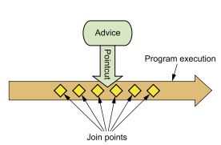

###Chapter 4 : 面向切面的Spring
> 在软件开发中, 散布于应用中多处的功能被称为横切关注点(cross-cutting concern).   
>
> 通常来讲, 这些横切关注点从概念上是与应用的业务逻辑相分离的(但是往往会直接嵌入到应用的业务逻辑之中).   
>
> 把这些横切关注点与业务逻辑相分离正是面向切面编程(AOP)所要解决的问题. 
>
> DI有助于应用对象之间的解耦, 而AOP可以实现横切关注点与它们所影响的对象之间的解耦. 

####1. _AOP_
+ 通知, 切点, 连接点三者关系图.   


+ 通知/Advice  
> 在AOP术语中, 切面的工作被称为通知. 通知定义了切面是什么以及何时使用. 除了描述切面要完成的工作, 通知还解决了何时执行这个工作的问题. 
  
Spring切面可以应用5种类型的通知：

| 通知类型                    | 功能                                                                        |
|-----------------------------|-----------------------------------------------------------------------------|
| 前置通知(Before)          | 在目标方法被调用之前调用通知功能;                                           |
| 后置通知(After)           | 在目标方法完成之后调用通知, 此时不会关心方法的输出是什么;                   |
| 返回通知(After-returning) | 在目标方法成功执行之后调用通知;                                             |
| 异常通知(After-throwing)  | 在目标方法抛出异常后调用通知;                                               |
| 环绕通知(Around)          | 通知包裹了被通知的方法, 在被通知的方法调用之前和调用之后 执行自定义的行为.  |

+ 连接点/Join point  
连接点是在应用执行过程中能够插入切面的一个点.   
这个点可以是调用方法时、抛出异常时、甚至修改一个字段时.   
切面代码可以利用这些点插入到应用的正常流程之中, 并添加新的行为.   

+ 切点/Pointcut  
切点的定义会匹配通知所要织入的一个或多个连接点.   
我们通常使用明确的类和方法名称, 或是利用正则表达式定义所匹配的类和方法名称来指定这些切点.   

有些AOP框架允许我们创建动态的切点, 可以根据运行时的决策(比如方法的参数值)来决定是否应用通知.   

+ 切面/Aspect  
切面是通知和切点的结合. 通知和切点共同定义了切面的全部内容——它是什么, 在何时和何处完成其功能.   

+ 引入/Introduction  
引入允许我们向现有的类添加新方法或属性.   
从而可以在无需修改这些现有的类的情况下, 让它们具有新的行为和状态.   

+ 织入/Weaving  
织入是把切面应用到目标对象并创建新的代理对象的过程.   
 
在目标对象的生命周期里有多个点可以进行织入：
    + 编译期：切面在目标类编译时被织入. 这种方式需要特殊的编译器. AspectJ的织入编译器就是以这种方式织入切面的. 
    + 类加载期：切面在目标类加载到JVM时被织入. 这种方式需要特殊的类加载器(ClassLoader), 它可以在目标类被引入应用之前增强该目标类的字节码. AspectJ5的加载时织入(load-time weaving, LTW)就支持以这种方式织入切面. 
    + 运行期：切面在应用运行的某个时刻被织入. 一般情况下, 在织入切面时, AOP容器会为目标对象动态地创建一个代理对象. Spring AOP就是以这种方式织入切面的. 

+ Spring AOP
    + 基于代理的经典Spring AOP; 
    + 纯POJO切面; 
    + @AspectJ注解驱动的切面; 
    + 注入式AspectJ切面(适用于Spring各版本). 

+ **四种方法优缺点**
    + 前三种方式都是Spring AOP实现的变体, [Spring AOP构建在动态代理基础之上, 因此, Spring对AOP的支持局限于方法拦截.]() :bangbang:  
    + 作者认为Spring的经典AOP编程模型并不怎么样, 因此并不做介绍. 
    + 第二种方式需要XML配置, 但这的确是声明式地将对象转换为切面的简便方式. 
    + 第三种方式的编程模型几乎与编写成熟的AspectJ注解切面完全一致. 这种AOP风格的好处在于能够不使用XML来完成功能. 
    + 第四种能够实现更加复杂的需求, 比如构造器或属性拦截. 
    
+ [Spring在运行时通知对象]()
通过在代理类中包裹切面, Spring在运行期把切面织入到Spring管理的bean中.   
代理类封装了目标类, 并拦截被通知方法的调用, 再把调用转发给真正的目标bean.   
当代理拦截到方法调用时, 在调用目标bean方法之前, 会执行切面逻辑.   


+ Spring只支持方法级别的连接点
Spring缺少对字段连接点的支持, 无法让我们创建细粒度的通知, 例如拦截对象字段的修改. 而且它不支持构造器连接点, 我们就无法在bean创建时应用通知.   
但是方法拦截可以满足绝大部分的需求. 如果需要方法拦截之外的连接点拦截功能, 那么我们可以利用Aspect来补充Spring AOP的功能. 

####2. _pointcut_
+ Spring AOP所支持的AspectJ切点指示器. 

| AspectJ指示 器 | 描述                                                                                          |
|----------------|-----------------------------------------------------------------------------------------------|
| arg()          | 限制连接点匹配参数为指定类型的执行方法                                                        |
| @args()        | 限制连接点匹配参数由指定注解标注的执行方法                                                    |
| execution()    | 用于匹配是连接点的执行方法                                                                    |
| this()         | 限制连接点匹配AOP代理的bean引用为指定类型的类                                                 |
| target         | 限制连接点匹配目标对象为指定类型的类                                                          |
| @target()      | 限制连接点匹配特定的执行对象, 这些对象对应的类要具有指定类型的注解                            |
| within()       | 限制连接点匹配指定的类型                                                                      |
| @within()      | 限制连接点匹配指定注解所标注的类型(当使用Spring AOP时, 方法定义在由指定的注解所标 注的类里) |
| @annotation    | 限定匹配带有指定注解的连接点                                                                  |

+ 创建切点
    + 假设有接口
    ```java
    public interface Performance {
      public void perform();
    }
    ```
    
    + 使用AspectJ切点表达式来选择Performance的perform()方法方法表达式以"*"号开始, 表明了我们不关心方法返回值的类型. 
      
    

    + 使用within()指示器限制切点范围, 下图配置的切点仅匹配concert包. [注意"&"在XML中有特殊含义, 所以在Spring的XML配置里面描述切点时, 可以使用and来代替"&&".]()  
    
    

    + 在切点中选择bean. 引入了一个新的bean()指示器, 它允许我们在切点表达式中使用bean的ID来标识bean. bean()使用bean ID或bean名称作为参数来限制切点只匹配特定的bean. 
    ```spel
    execution(* concert.Performance.perform())
          and bean('woodstock')
    ```
    
####3. _使用注解创建切面_
+ 定义切面类
```java
package concert;
import org.aspectj.lang.annotation.AfterReturning;
import org.aspectj.lang.annotation.AfterThrowing;
import org.aspectj.lang.annotation.Aspect;
import org.aspectj.lang.annotation.Before;
@Aspect
public class Audience {
    @Before("execution(** concert.Performance.perform(..))")
    public void silenceCellPhones() {
      System.out.println("Silencing cell phones");
    }
    @Before("execution(** concert.Performance.perform(..))")
    public void takeSeats() {
      System.out.println("Taking seats");
    }
    @AfterReturning("execution(** concert.Performance.perform(..))")
    public void applause() {
      System.out.println("CLAP CLAP CLAP!!!");
    }
    @AfterThrowing("execution(** concert.Performance.perform(..))")
    public void demandRefund() {
      System.out.println("Demanding a refund");
    }
}
```
    
如上. AspectJ一共提供了五个注解来定义通知AspectJ注解说明

| 注解            | 通知                                     |
|-----------------|------------------------------------------|
| @After          | 通知方法会在目标方法返回或抛出异常后调用 |
| @AfterReturning | 通知方法会在目标方法返回后调用           |
| @AfterThrowing  | 通知方法会在目标方法抛出异常后调用       |
| @Around         | 通知方法会将目标方法封装起来             |
| @Before         | 通知方法会在目标方法调用之前执行         |

[但是在上面的切面定义中, 相同的切点表达式重复了四遍, 这是不应该发生的, 可以用@Pointcut定义可重用的切点. ]() 

```java
@Aspect
public class Audience {
    
    //performance()方法的实际内容并不重要, 在这里它实际上应该是空的. 其实该方法本身只是一个标识, 供@Pointcut注解依附. 
    @Pointcut("execution(** concert.Performance.perform(..))")
    public void performance() {}
    
    @Before("performance()")
    public void silenceCellPhones() {
        System.out.println("Silencing cell phones");
    }
    @Before("performance()")
    public void takeSeats() {
        System.out.println("Taking seats");
    }
    @AfterReturning("performance()")
    public void applause() {
        System.out.println("CLAP CLAP CLAP!!!");
    }
    @AfterThrowing("performance()")
    public void demandRefund() {
        System.out.println("Demanding a refund");
    }
}
```
+ [为定义的切面启动自动代理, 否则只能是Spring容器中的bean.]() :bangbang:
不管你是使用JavaConfig还是XML, AspectJ自动代理都会为使用@Aspect注解的bean创建一个代理, 这个代理会围绕着所有该切面的切点所匹配的bean. 
    
    + JavaConfig中启用AspectJ注解的自动代理
    ```java
    @Configuration
    // 启用AspectJ自动代理
    @EnableAspectJAutoProxy
    @ComponentScan
    public class ConcertConfig {
      @Bean
      public Audience audience() {
          return new Audience();
      }
    }
    ```
    
    + 在XML中AspectJ自动代理
    ```xml
    <?xml version="1.0" encoding="UTF-8"?>
    <beans xmlns="http://www.springframework.org/schema/beans"
        xmlns:xsi="http://www.w3.org/2001/XMLSchema-instance"
        xmlns:context="http://www.springframework.org/schema/context"
        xmlns:aop="http://www.springframework.org/schema/aop"
        xsi:schemaLocation="http://www.springframework.org/schema/aop
        http://www.springframework.org/schema/aop/spring-aop.xsd
        http://www.springframework.org/schema/beans
        http://www.springframework.org/schema/beans/spring-beans.xsd
        http://www.springframework.org/schema/context
        http://www.springframework.org/schema/context/spring-context.xsd">
        <context:component-scan base-package="concert" />
        <aop:aspectj-autoproxy />
        <bean class="concert.Audience" />
    </beans>
    ```

+ 创建环绕通知/@Around
环绕通知是最为强大的通知类型. 它能够让你所编写的逻辑将被通知的目标方法完全包装起来. 实际上就像在一个通知方法中同时编写前置通知和后置通知. 上就像在一个通知方法中同时编写前置通知和后置通知. 

    ```java
    @Aspect
    public class Audience {
        @Pointcut("execution(** concert.Performance.perform(..))")
        public void performance() {}
        @Around("performance()")
        public void watchPerformance(ProceedingJoinPoint jp) {
            try {
                System.out.println("Silencing cell phones");
                System.out.println("Taking seats");
                // 将控制权交给被通知的方法
                // 如果不调这个方法的话, 那么你的通知实际上会阻塞对被通知方法的调用. 
                jp.proceed();
                System.out.println("CLAP CLAP CLAP!!!");
            } catch (Throwable e) {
                System.out.println("Demanding a refund");
            }
        }
    }
    ```

如上面示例, @Around注解表明watchPerformance()方法会作为performance()切点的环绕通知.   
[不调用proceed()方法, 实现重试逻辑, 也就是在被通知方法失败后, 进行重复尝试.]()

+ 处理通知中的参数


+ 通过注解引入新功能
工作原理:


当引入接口的方法被调用时, 代理会把此调用委托给实现了新接口的某个其他对象. 实际上, 一个bean的实现被拆分到了多个类中.   

示例：
引入接口定义

```java
package concert;
public interface Encoreable {
    void performEncore();
}
```

切面定义：
```java
import org.aspectj.lang.annotation.Aspect;
import org.aspectj.lang.annotation.DeclareParents;
@Aspect
public class EncoreableIntroducer {
    @DeclareParents(value="concert.Performance+",
    defaultImpl=DefaultEncoreable.class)
    public static Encoreable encoreable;
}
```
    
通过@DeclareParents注解, 将Encoreable接口引入到Performance bean中. 
@DeclareParents注解由三部分组成：
    + value属性指定了哪种类型的bean要引入该接口. 在本例中, 也就是所有实现Performance的类型. (标记符后面的加号表示是Performance的所有子类型, 而不是Performance本身. )
    + defaultImpl属性指定了为引入功能提供实现的类. 在这里, 我们指定的是DefaultEncoreable提供实现. 
    + @DeclareParents注解所标注的静态属性指明了要引入了接口. 在这里, 我们所引入的是Encoreable接口. 

和其他的切面一样, 我们需要在Spring应用中将EncoreableIntroducer声明为一个bean：
```xml
<bean class="concert.EncoreableIntroducer" />
```

> 在Spring中, 注解和自动代理提供了一种很便利的方式来创建切面. 它非常简单, 并且只涉及到最少的Spring配置. 
但是, 面向注解的切面声明有一个明显的劣势：你必须能够为通知类添加注解. 为了做到这一点, 必须要有源码. 如果你没有源码的话, 或者不想将AspectJ注解放到你的代码之中. 
Spring为切面提供了另外一种可选方案. 

####4. _在XML中声明切面_
+ Spring的aop命名空间

| AOP配置元素             | 用途                                            |
|-------------------------|-------------------------------------------------|
| \<aop:advisor>           | 定义AOP通知器                                   |
| \<aop:after>             | 定义AOP后置通知(不管被通知的方法是否执行成功) |
| \<aop:after-returning>   | 定义AOP返回通知                                 |
| \<aop:afther-throwing>   | 定义AOP异常通知                                 |
| \<aop:around>            | 定义AOP环绕通知                                 |
| \<aop:aspect>            | 定义一个切面                                    |
| \<aop:aspectj-autoproxy> | 启用@AspectJ注解驱动的切面                      |
| \<aop:before>            | 定义一个AOP前置通知                             |
| \<aop:config>            | 顶层的AOP配置元素. 大多数的元素必须包含在元素内 |
| \<aop:declare-parent>    | 以透明的方式为被通知的对象引入额外的接口        |
| \<aop:pointcut>          | 定义一个切点                                    |

+ 声明前置和后置通知
    ```xml
    <aop:config>
        <aop:aspect ref="audience">
            <aop:pointcut
                id="performance"
                expression="execution(** concert.Performance.perform(..))" />
            <!--<aop:before>元素定义了匹配切点的方法执行之前调用前置通知方法-->
            <aop:before
                pointcut-ref="performance"
                method="silenceCellPhones"/>
            <!--<aop:after-returning>元素定义了一个返回(after-returning)通知, 在切点所匹配的方法调用之后再调用对应方法-->
            <aop:before
                pointcut-ref="performance"
                method="takeSeats"/>
            <aop:after-returning
                pointcut-ref="performance"
                method="applause"/>
            <!--<aop:after-throwing>元素定义了异常(after-throwing)通知-->
            <aop:after-throwing
                pointcut-ref="performance"
                method="demandRefund"/>
            
            <!--<aop:around>指定了一个切点和一个通知方法的名字. -->
            <aop:around
                pointcut-ref="performance"
                method="watchPerformance"/>
        </aop:aspect>
    </aop:config>
    ```
    


+ 为通知传递参数
[和Java的唯一的差别在于这里使用and关键字而不是"&&"(``因为在XML中, "&"符号会被解析为实体的开始).]()

+ 通过切面引入新的功能
\<aop:declare-parents>声明了此切面所通知的bean要在它的对象层次结构中拥有新的父类型.   
default-impl属性用全限定类名来显式指定Encoreable的实现. 
使用delegate-ref属性来标识. 

####5. [_注入AspectJ切面_]() :bangbang:
+ 关键字: **aspect**
+ 示例:  
    ```java
    public aspect CriticAspect {
        public CriticAspect() {}
        pointcut performance() : execution(* perform(..));
        afterReturning() : performance() {
          System.out.println(criticismEngine.getCriticism());
        }
        private CriticismEngine criticismEngine;
        public void setCriticismEngine(CriticismEngine criticismEngine) {
          this.criticismEngine = criticismEngine;
        }
    }
    ```
    
    ```java
    public class CriticismEngineImpl implements CriticismEngine {
        public CriticismEngineImpl() {}
        public String getCriticism() {
            int i = (int) (Math.random() * criticismPool.length);
            return criticismPool[i];
        }
        // injected
        private String[] criticismPool;
            public void setCriticismPool(String[] criticismPool) {
            this.criticismPool = criticismPool;
        }
    }
    ```
    
    ```xml
    ...
    <bean id="criticismEngine"
      class="com.springinaction.springidol.CriticismEngineImpl">
        <property name="criticismPool">
            <list>
            <value>Worst performance ever!</value>
            <value>I laughed, I cried, then I realized I was at the
                      wrong show.</value>
            <value>A must see show!</value>
            </list>
        </property>
    </bean>
    ...
    <bean class="com.springinaction.springidol.CriticAspect"
          factory-method="aspectOf">
        <property name="criticismEngine" ref="criticismEngine" />
    </bean>
    ```

+ [所有的AspectJ切面都提供了一个静态的aspectOf()方法, 该方法返回切面的一个单例. 所以为了获得切面的实例, 我们必须使用factory-method来调用asepctOf()方法而不是调用CriticAspect的构造器方法.]() :bangbang:
+ [在使用aspect的情况下, Spring不能使用<bean>声明来创建一个切面实例——它已经在运行时由AspectJ创建完成了. Spring需要通过aspectOf()工厂方法获得切面的引用, 然后像<bean>元素规定的那样在该对象上执行依赖注入.]()