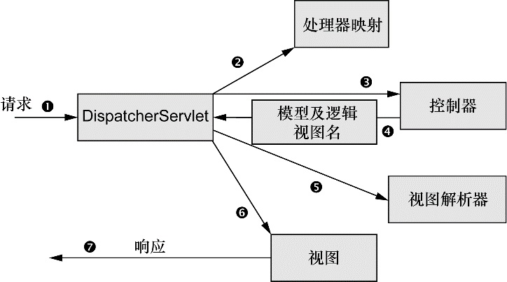

###Chapter 5 : 构建Spring Web应用程序
本章通过构建一个非常简单的类似早期Twitter的应用, 一些代码并不适宜放入当前笔记, 想看源代码的请点击[这里](src/main).

####1. [__DispatcherServlet__]()
+ DispatcherServlet工作流程图:



+ DispatcherServlet工作流程:
    + 1. 在Spring MVC中, DispatcherServlet就是前端控制器. DispatcherServlet的任务是将请求发送给Spring MVC控制器(controller)
    + 2. DispatcherServlet需要知道应该将请求发送给哪个控制器. 所以DispatcherServlet以会查询一个或多个处理器映射, 来确定请求的下一站在哪里. 处理器映射会根据请求所携带的URL信息来进行决策. 
    + 3. 一旦选择了合适的控制器, DispatcherServlet会将请求发送给选中的控制器. **实际上, 设计良好的控制器本身只处理很少甚至不处理工作, 而是将业务逻辑委托给一个或多个服务对象进行处理.** 
    + 4. 控制器在完成逻辑处理后, 通常会产生一些信息, 这些信息需要返回给用户并在浏览器上显示. 这些信息被称为模型 **model**. 控制器所做的最后一件事就是将模型数据打包, 并且标示出用于渲染输出的视图名. 它接下来会将请求连同模型和视图名发送回DispatcherServlet.
    + 5. DispatcherServlet将会使用视图解析器(view resolver)来将逻辑视图名匹配为一个特定的视图实现, **它可能是也可能不是JSP**. 
    + 6. DispatcherServlet交付模型数据.
    + 7. 视图将使用模型数据渲染输出, 这个输出会通过响应对象传递给客户端.
    
####2. _搭建Spring MVC_
+ 配置依赖包. 
    + 以Maven为例, 注意这里省略了Spring的基础依赖配置. 
    ```xml
    <dependency>
        <groupId>org.springframework</groupId>
        <artifactId>spring-web</artifactId>
        <version>4.3.5.RELEASE</version>
    </dependency>
    <dependency>
        <groupId>org.springframework</groupId>
        <artifactId>spring-webmvc</artifactId>
        <version>4.3.5.RELEASE</version>
    </dependency>
    ```
    
+ 配置DispatcherServlet
    + 传统方式: 在web.xml文件中配置. 
    + 本章方式: 在Servlet容器中配置. 
    ```java
    package spittr.config;
    import org.springframework.web.servlet.support.AbstractAnnotationConfigDispatcherServletInitializer;
    /**
     * \* Created with Chen Zhe on 1/15/2017.
     * \* Description: 负责将请求路由到其他的组件中
     * \* @author ChenZhe
     * \* @author q953387601@163.com
     * \* @version 1.0.0
     * \
     */
    public class SpittrWebAppInitializer
            extends AbstractAnnotationConfigDispatcherServletInitializer{
    
        /**
         * 配置RootConfig类的位置
         * @return 返回带有@configuration注解的类, 用于配置ContextLoaderListener应用上下文
         */
        @Override
        protected Class<?>[] getRootConfigClasses() {
            return new Class<?>[] { RootConfig.class};
        }
    
        /**
         * 配置WebConfig类的位置
         * @return 返回带有@Configuration注解的bean, 用于配置DispatcherServlet应用上下文
         */
        @Override
        protected Class<?>[] getServletConfigClasses() {
            return new Class<?>[] { WebConfig.class};
        }
    
        /**
         * 将一个或多个路径映射到DispatcherServlet上
         * 这里通过 "/" 声明它会是默认Servlet, 他会处理进入应用的所有请求. 
         */
        @Override
        protected String[] getServletMappings() {
            return new String[] { "/" };
        }
    }
    ```

+ **AbstractAnnotationConfigDispatcherServletInitializer** 剖析

    >   在Servlet 3.0+ 环境中, 容器会在类路径中查找实现javax.servlet.ServletContainerInitializer接口的类, 如果能发现的话, 就会用它来配置Servlet容器.Spring提供了这个接口的实现, 名为SpringServletContainerInitializer, 这个类反过来又会查找实现WebApplicationInitializer的类并将配置的任务交给它们来完成. 
        Spring 3.2引入了一个便利的WebApplicationInitializer基础实现, 也就是AbstractAnnotationConfigDispatcherServletInitializer. 因为我们的SpittrWebAppInitializer扩展了AbstractAnnotationConfigDispatcherServletInitializer(同时也就实现了WebApplicationInitializer), 因此当部署到Servlet 3.0容器中的时候, 容器会自动发现它, 并用它来配置Servlet上下文. 
        getServletMappings(),  它会将一个或多个路径映射到DispatcherServlet上. 上面示例中, 它映射的是"/", 这表示它会是应用的默认Servlet. 它会处理进入应用的所有请求.  
        getServletConfigClasses()方法返回的带有@Configuration注解的类将会用来定义DispatcherServlet应用上下文中的bean. 
    >   getRootConfigClasses()方法返回的带有@Configuration注解的类将会用来配置ContextLoaderListener创建的应用上下文中的bean. 

    >   DispatcherServlet和一个Servlet监听器(也就是ContextLoaderListener)的关系. 当DispatcherServlet启动的时候, 它会创建Spring应用上下文, 并加载配置文件或配置类中所声明的bean. 在程序清单5.1的getServletConfigClasses()方法中, 我们要求DispatcherServlet加载应用上下文时, 使用定义在WebConfig配置类(使用Java配置)中的bean. 但是在Spring Web应用中, 通常还会有另外一个应用上下文. 另外的这个应用上下文是由ContextLoaderListener创建的. 
    >   我们希望DispatcherServlet加载包含Web组件的bean, 如控制器, 视图解析器以及处理器映射, 而ContextLoaderListener要加载应用中的其他bean. 这些bean通常是驱动应用后端的中间层和数据层组件. 

+ [启动Spring MVC]()
    + 创建带有@EnableWebMvc注解的类. [注意看代码注释.]()
    ```java
    package spittr.config;
    import org.springframework.context.annotation.Bean;
    import org.springframework.context.annotation.ComponentScan;
    import org.springframework.context.annotation.Configuration;
    import org.springframework.web.servlet.ViewResolver;
    import org.springframework.web.servlet.config.annotation.DefaultServletHandlerConfigurer;
    import org.springframework.web.servlet.config.annotation.EnableWebMvc;
    import org.springframework.web.servlet.config.annotation.WebMvcConfigurerAdapter;
    import org.springframework.web.servlet.view.InternalResourceViewResolver;
    /**
     * \* Created with Chen Zhe on 1/15/2017.
     * \* Description:
     *      DispatcherServlet会加载当前类也就是@Configuration注解的类, 用于配置DispatcherServlet
     * \* @author ChenZhe
     * \* @author q953387601@163.com
     * \* @version 1.0.0
     * \
     */
    
    @Configuration                  //声明当前Java类为Spring配置类
    @EnableWebMvc                   //启用Spring MVC
    @ComponentScan("spittr.web")    //配置组件扫描路径, 否则Spring将只能找到显式声明在当前类中的控制器
                                    //书上写的包路径有问题, 配置包路径与实际包名称不符, 需要自己注意
    public class WebConfig
            extends WebMvcConfigurerAdapter{
    
        /**
         * Description : 配置试图解析器, 如果不配置则会使用默认的BeanNameViewResolver. 
         *               Spring默认会使用BeanNameView-Resolver, 这个视图解析器会查找ID
         *               与视图名称匹配的bean, 并且查找的bean要实现View接口, 它以这样的
         *               方式来解析视图. 
         */
        @Bean
        public ViewResolver viewResolver(){
            InternalResourceViewResolver resolver =
                    new InternalResourceViewResolver();
            //用于拼接, 从而匹配对应的视图, 注意看后缀设置使得即使文件的匹配更加灵活, 可以不是jsp
            resolver.setPrefix("/WEB-INF/views/");
            resolver.setSuffix(".jsp");
            resolver.setExposeContextBeansAsAttributes(true);
            return resolver;
        }
    
        /**
         * Description : 配置静态资源的处理, 否则的话DispatcherServlet会处理所有静态资源的请求
         */
        @Override
        public void configureDefaultServletHandling(DefaultServletHandlerConfigurer configurer) {
            
          // 静态资源的请求转发到Servlet容器中默认的Servlet上, 而不是使用DispatcherServlet本身来处理此类请求
          configurer.enable();
        
        }
    }

    ```
    
+ 创建RootConfig类, 因为聚焦于Web开发, 所以暂时应用程序上下文配置的较为简单
    + 示例代码: 
    ```java
    package spittr.config;
    import org.springframework.context.annotation.ComponentScan;
    import org.springframework.context.annotation.Configuration;
    import org.springframework.context.annotation.FilterType;
    import org.springframework.web.servlet.config.annotation.EnableWebMvc;
    /**
     * \* Created with Chen Zhe on 1/15/2017.
     * \* Description:
     *      DispatcherServlet会加载当前类也就是@Configuration注解的类, 用于配置ContextLoaderListener
     * \* @author ChenZhe
     * \* @author q953387601@163.com
     * \* @version 1.0.0
     * \
     */
    @Configuration
    //书上写的包路径有问题, 配置包路径与实际包名称不符, 需要自己注意
    @ComponentScan(basePackages = {"spittr.web"},
        excludeFilters = {
            @ComponentScan.Filter(type = FilterType.ANNOTATION, value = EnableWebMvc.class)
        })
    public class RootConfig{
    }

    ```
    
####3. [_控制器/@Controller_]()
+ 通过 **@Controller** 注解声明控制器类, 但实际上这个注解对Spring MVC本身的影响并不大, 这里是用于辅助实现组件扫描的.
+ **@Controller** 注解基于 **@Component** 注解, 因此使用 **@Component** 注解效果相同, [但是在表意性上可能会差一些]().
+ 通过 **@RequestMapping** 注解可以从各个角度限定方法处理的请求. 详情见下. 
+ [**@RequestMapping** 可以被用到类级别, 从而从类级别限定请求路径等, 并且支持String数组, 从而匹配多个请求路径.]()
+ 传递模型数据: 
    + [Model实际上就是一个Map(也就是key-value对的集合), 它会传递给视图, 这样数据就能渲染到客户端了. 当调用addAttribute()方法并且不指定key的时候, 那么key会根据值的对象类型推断确定. ]() :bangbang:
    ```java
    @RequestMapping(method=RequestMethod.GET)
    public String spittles(Model model) {
        model.addAttribute(
            spittleRepository.findSpittles(
                Long.MAX_VALUE, 20));
        return "spittles";
    }
    ```
    
    + 如果你希望使用非Spring类型的话, 那么可以用java.util.Map来代替Model. 
    ```java
    @RequestMapping(method=RequestMethod.GET)
    public String spittles(Model model) {
        model.addAttribute("spittleList",spittleRepository.findSpittles(Long.MAX_VALUE, 20));
        return "spittles";
    }
    ```
    
    + [Model可以不再方法传递是显示声明, 也可以在返回时不显式地设定模型.]() :bangbang:
    ```java
    @RequestMapping(method=RequestMethod.GET)
    public List<Spittle> spittles() {
      return spittleRepository.findSpittles(Long.MAX_VALUE, 20));
    }
    ```
    
+ 当视图是JSP的时候, 模型数据会作为请求属性放到请求(request)之中, 这样就可以使用JSTL等标签进行操作. 

####4. [_@RequestMapping使用_]() :bangbang:
+ value, method使用. value: 指定请求的实际地址, 指定的地址可以是URI Template 模式(后面将会说明); method: 指定请求的method类型,  GET, POST, PUT, DELETE等. 
    + 通过value指定方法处理的请求路径
    ```java
    @RequestMapping(value="/departments", method = RequestMethod.GET)
    public String simplePattern(){
    
      System.out.println("simplePattern method was called");
      return "someResult";
    
    }
    ```
    
    + 参数绑定
    ```java
    @RequestMapping(value="/departments")
    public String findDepatment(
      @RequestParam("departmentId") String departmentId, method = RequestMethod.GET){
      
        System.out.println("Find department with ID: " + departmentId);
        return "someResult";
    
    }
    ```
    
    + REST风格的参数
    ```java
    @RequestMapping(value="/departments/{departmentId}")
    public String findDepatment(@PathVariable String departmentId, method = RequestMethod.GET){
    
      System.out.println("Find department with ID: " + departmentId);
      return "someResult";
    
    }
    ```
    
    + REST风格的参数绑定形式之2
    ```java
    @RequestMapping(value="/departments/{departmentId}", method = RequestMethod.GET)
    public String findDepatmentAlternative(
      @PathVariable("departmentId") String someDepartmentId){
    
        System.out.println("Find department with ID: " + someDepartmentId);
        return "someResult";
    
    }
    ```
    
    + url中同时绑定多个id
    ```java
    @RequestMapping(value="/departments/{departmentId}/employees/{employeeId}", method = RequestMethod.GET)
    public String findEmployee(
      @PathVariable String departmentId,
      @PathVariable String employeeId){
    
        System.out.println("Find employee with ID: " + employeeId + 
          " from department: " + departmentId);
        return "someResult";
    
    }
    ```
    
    + 支持正则表达式
    ```java
    @RequestMapping(value="/{textualPart:[a-z-]+}.{numericPart:[\\d]+}", method = RequestMethod.GET)
    public String regularExpression(
      @PathVariable String textualPart,
      @PathVariable String numericPart){
    
        System.out.println("Textual part: " + textualPart + 
          ", numeric part: " + numericPart);
        return "someResult";
    }
    ```
    
+ consumes, produces使用. consumes: 指定处理请求的提交内容类型(Content-Type), 例如application/json, text/html; produces: 指定返回的内容类型, 仅当request请求头中的(Accept)类型中包含该指定类型才返回; 
    + cousumes的样例: 
    ```java
    @Controller  
    @RequestMapping(value = "/pets", method = RequestMethod.POST, consumes="application/json")  
    public void addPet(@RequestBody Pet pet, Model model) {      
        // 方法仅处理request Content-Type为"application/json"类型的请求.   
    }  
    ```
    
    + produces的样例: 
    ```java
    @Controller  
    @RequestMapping(value = "/pets/{petId}", method = RequestMethod.GET, produces="application/json")  
    @ResponseBody  
    public Pet getPet(@PathVariable String petId, Model model) {      
        // 方法仅处理request请求中Accept头中包含了"application/json"的请求, 同时暗示了返回的内容类型为application/json;  
    }  
    ```
    
+ params, headers使用. params: 指定request中必须包含某些参数值是, 才让该方法处理; headers: 指定request中必须包含某些指定的header值, 才能让该方法处理请求. 
    + params的样例: 
    ```java
    @Controller  
    @RequestMapping("/owners/{ownerId}")  
    public class RelativePathUriTemplateController {  
      
      @RequestMapping(value = "/pets/{petId}", method = RequestMethod.GET, params="myParam=myValue")  
      public void findPet(@PathVariable String ownerId, @PathVariable String petId, Model model) {      
        //  仅处理请求中包含了名为"myParam", 值为"myValue"的请求;  
      }  
    }
    ```
    
    + headers的样例: 
    ```java
    @Controller  
    @RequestMapping("/owners/{ownerId}")  
    public class RelativePathUriTemplateController {  
      
    @RequestMapping(value = "/pets", method = RequestMethod.GET, headers="Referer=http://www.ifeng.com/")  
      public void findPet(@PathVariable String ownerId, @PathVariable String petId, Model model) {      
        // 仅处理request的header中包含了指定"Refer"请求头和对应值为"http://www.ifeng.com/"的请求; 
      }  
    }  
    ```
    
####4. [_handler method 参数绑定_]() :bangbang:
+ handler method 参数绑定常用的注解, 根据他们处理的Request的不同内容部分分为四类(常用)
    + 处理requet uri 部分(这里指uri template中variable, 不含queryString部分)的注解: @PathVariable. 
    + 处理request header部分的注解: @RequestHeader, @CookieValue. 
    + 处理request body部分的注解: @RequestParam, @RequestBody. 
    + 处理attribute类型是注解: @SessionAttributes, @ModelAttribute. 

+ **@PathVariable**
    + 当使用@RequestMapping URI template 样式映射时, 即 someUrl/{paramId}, 这时的paramId可通过@Pathvariable注解绑定它传过来的值到方法的参数上. 
    + 示例代码: 
    ```java
    @Controller  
    @RequestMapping("/owners/{ownerId}")  
    public class RelativePathUriTemplateController {  
      
      @RequestMapping("/pets/{petId}")  
      public void findPet(@PathVariable String ownerId, @PathVariable String petId, Model model) {      
        // 代码把URI template 中变量 ownerId的值和petId的值, 绑定到方法的参数上. 若方法参数名称和需要绑定的uri template中变量名称不一致, 需要在@PathVariable("name")指定uri template中的名称.   
      }  
    }  
    ```
    
+ **@PathVariable**
    + @RequestHeader注解, 可以把Request请求header部分的值绑定到方法的参数上.
    + [如果@PathVariable中没有value属性的话, 它会假设占位符的名称与方法的参数名相同. 这能够让代码稍微简洁一些, 因为不必重复写占位符的名称了. 但需要注意的是, 如果你想要重命名参数时, 必须要同时修改占位符的名称, 使其互相匹配.]()
    + 示例代码: 
    ```java
    /*
    Host                    localhost:8080  
    Accept                  text/html,application/xhtml+xml,application/xml;q=0.9  
    Accept-Language         fr,en-gb;q=0.7,en;q=0.3  
    Accept-Encoding         gzip,deflate  
    Accept-Charset          ISO-8859-1,utf-8;q=0.7,*;q=0.7  
    Keep-Alive              300  
    */
    @RequestMapping("/displayHeaderInfo.do")  
    public void displayHeaderInfo(@RequestHeader("Accept-Encoding") String encoding,  
                                  @RequestHeader("Keep-Alive") long keepAlive)  {  
      
      //把request header部分的 Accept-Encoding的值, 绑定到参数encoding上了,  Keep-Alive header的值绑定到参数keepAlive上.  
    }
    ```

+ **@CookieValue**
    + 把Request header中关于cookie的值绑定到方法的参数上. 
    + 示例代码: 
    ```java
    /*
    JSESSIONID=415A4AC178C59DACE0B2C9CA727CDD84
    */
    @RequestMapping("/displayHeaderInfo.do")  
    public void displayHeaderInfo(@CookieValue("JSESSIONID") String cookie)  {  
      //把JSESSIONID的值绑定到参数cookie上.  
    }  
    ```
    
+ **@RequestParam**
    + 1. 常用来处理简单类型的绑定, 通过Request.getParameter()获取的String可直接转换为简单类型的情况(String--> 简单类型的转换操作由ConversionService配置的转换器来完成); 因为使用request.getParameter()方式获取参数, 所以可以处理get方式中queryString的值, 也可以处理post方式中body data的值; 
    + 2. 用来处理Content-Type: 为application/x-www-form-urlencoded编码的内容, 提交方式GET, POST; 
    + 3. 注解有两个属性: value, required; value用来指定要传入值的id名称, required用来指示参数是否必须绑定; 
    + 示例代码: 
    ```java
    @Controller  
    @RequestMapping("/pets")  
    @SessionAttributes("pet")  
    public class EditPetForm {  
        // ...  
        @RequestMapping(method = RequestMethod.GET)  
        public String setupForm(@RequestParam("petId") int petId, ModelMap model) {  
            Pet pet = this.clinic.loadPet(petId);  
            model.addAttribute("pet", pet);  
            return "petForm";  
        }  
        // ...  
    }
    ```
    
+ **@RequestBody**
    + 常用来处理Content-Type: 不是application/x-www-form-urlencoded编码的内容, 例如application/json, application/xml等; 它是通过使用HandlerAdapter 配置的HttpMessageConverters来解析post data body, 然后绑定到相应的bean上的. 因为配置有FormHttpMessageConverter, 所以也可以用来处理 application/x-www-form-urlencoded的内容, 处理完的结果放在一个MultiValueMap<String, String>里, 这种情况在某些特殊需求下使用, 
    + 示例代码:   
    ```java
    @RequestMapping(value = "/something", method = RequestMethod.PUT)  
    public void handle(@RequestBody String body, Writer writer) throws IOException {  
      writer.write(body);  
    }  
    ```
    
+ **@SessionAttributes**
    + 用来绑定HttpSession中的attribute对象的值, 便于在方法中的参数里使用. 该注解有value, types两个属性, 可以通过名字和类型指定要使用的attribute对象; 
    + 示例代码: 
    ```java
    @Controller  
    @RequestMapping("/editPet.do")  
    @SessionAttributes("pet")  
    public class EditPetForm {  
        // ...  
    }  
    ```
    
+ **@ModelAttribute**
    + 用于方法上时: 通常用来在处理@RequestMapping之前, 为请求绑定需要从后台查询的model; 
    + 用于参数上时: 用来通过名称对应, 把相应名称的值绑定到注解的参数bean上; 要绑定的值来源于: 
    + 示例代码: 
    ```java
    // Add one attribute  
    // The return value of the method is added to the model under the name "account"  
    // You can customize the name via @ModelAttribute("myAccount")  
      
    @ModelAttribute  
    public Account addAccount(@RequestParam String number) {
        //在调用@RequestMapping的方法之前, 为request对象的model里put("account",  Account); 
        return accountManager.findAccount(number);  
    }  
  
    RequestMapping(value="/owners/{ownerId}/pets/{petId}/edit", method = RequestMethod.POST)  
    public String processSubmit(@ModelAttribute Pet pet) {  
       //首先查询 @SessionAttributes有无绑定的Pet对象, 若没有则查询@ModelAttribute方法层面上是否绑定了Pet对象, 若没有则将URI template中的值按对应的名称绑定到Pet对象的各属性上. 
    }  
    ```
    
####5. _处理表单_
+ **@RequestMapping** method属性调整为GET方法用以显示表单. 
+ **@RequestMapping** method属性调整为POST方法用以校验表单. 
+ [页面重定向]()

当InternalResourceViewResolver看到视图格式中的"redirect:"前缀时, 它就知道要将其解析为重定向的规则, 而不是视图的名称. 

需要注意的是, 除了"redirect:", InternalResourceViewResolver还能识别"forward:"前缀. 当它发现视图格式中以"forward:"作为前缀时, 请求将会前往(forward)指定的URL路径, 而不再是重定向. 

+ 示例代码: 
    ```java
    @Controller
    @RequestMapping("/spitter")
    public class SpitterController {
        private SpitterRepository spitterRepository;
        @Autowired
        public SpitterController(
          SpitterRepository spitterRepository) {
              this.spitterRepository = spitterRepository;
        }
        @RequestMapping(value="/register", method=GET)
        public String showRegistrationForm() {
              return "registerForm";
        }
        @RequestMapping(value="/{username}", method=GET)
        public String showSpitterProfile(
        @PathVariable String username, Model model) {
              Spitter spitter = spitterRepository.findByUsername(username);
              model.addAttribute(spitter);
              return "profile";
        }
        @RequestMapping(value="/register", method=POST)
        public String processRegistration(Spitter spitter) {
              spitterRepository.save(spitter);
              return "redirect:/spitter/" +
                      spitter.getUsername();
        }
    }
    ```
    
+ 校验表单
    + 从Spring 3.0开始, 在Spring MVC中提供了对Java校验API的支持. 在Spring MVC中要使用Java校验API的话, 并不需要什么额外的配置. 只要保证在类路径下包含这个Java API的实现即可, 比如Hibernate Validator. 
    ```xml
    <dependency>
        <groupId>javax.validation</groupId>
        <artifactId>validation-api</artifactId>
        <version>1.1.0.Final</version>
    </dependency>
    <dependency>
        <groupId>org.hibernate</groupId>
        <artifactId>hibernate-validator</artifactId>
        <version>5.2.4.Final</version>
    </dependency>
    ```
    
    + Java校验API所提供的校验注解
    
    | 注解         | 描述                                                                               |
    |--------------|------------------------------------------------------------------------------------|
    | @AssertFalse | 所注解的元素必须是Boolean类型, 并且值为false                                       |
    | @AssertTrue  | 所注解的元素必须是Boolean类型, 并且值为true                                        |
    | @DecimalMax  | @DecimalMax 所注解的元素必须是数字, 并且它的值要小于或等于给定的BigDecimalString值 |
    | @DecimalMin  | 所注解的元素必须是数字, 并且它的值要大于或等于给定的BigDecimalString值             |
    | @Digits      | 所注解的元素必须是数字, 并且它的值必须有指定的位数                                 |
    | @Future      | 所注解的元素的值必须是一个将来的日期                                               |
    | @Max         | 所注解的元素必须是数字, 并且它的值要小于或等于给定的值                             |
    | @Min         | 所注解的元素必须是数字, 并且它的值要大于或等于给定的值                             |
    | @NotNull     | 所注解元素的值必须不能为null                                                       |
    | @Null        | 所注解元素的值必须为null                                                           |
    | @Past        | 所注解的元素的值必须是一个已过去的日期                                             |
    | @Pattern     | 所注解的元素的值必须匹配给定的正则表达式                                           |
    | @Size        | 所注解的元素的值必须是String, 集合或数组, 并且它的长度要符合给定的范围             |
    
    + 属性校验示例代码
    ```java
    package spittr.entity;
    
    import org.apache.commons.lang3.builder.EqualsBuilder;
    import org.apache.commons.lang3.builder.HashCodeBuilder;
    import org.hibernate.validator.constraints.Email;
    
    import javax.validation.constraints.NotNull;
    import javax.validation.constraints.Size;
    
    /**
     * Created by ChenZhePC on 2017/1/16.
     */
    
    public class Spitter {
        private Long id;
    
        @NotNull
        @Size(min = 5, max = 16)
        private String username;
    
        @NotNull
        @Size(min = 5, max = 25)
        private String password;
    
        @NotNull
        @Size(min = 2, max = 30)
        private String firstName;
    
        @NotNull
        @Size(min = 2, max = 30)
        private String lastName;
    
        @NotNull
        @Email
        private String email;
    
        public Spitter() {}
    
        public Spitter(String username, String password, String firstName, String lastName, String email) {
            this(null, username, password, firstName, lastName, email);
        }
    
        public Spitter(Long id, String username, String password, String firstName, String lastName, String email) {
            this.id = id;
            this.username = username;
            this.password = password;
            this.firstName = firstName;
            this.lastName = lastName;
            this.email = email;
        }
    
        public Long getId() {
            return id;
        }
    
        public void setId(Long id) {
            this.id = id;
        }
    
        public String getUsername() {
            return username;
        }
    
        public void setUsername(String username) {
            this.username = username;
        }
    
        public String getPassword() {
            return password;
        }
    
        public void setPassword(String password) {
            this.password = password;
        }
    
        public String getFirstName() {
            return firstName;
        }
    
        public void setFirstName(String firstName) {
            this.firstName = firstName;
        }
    
        public String getLastName() {
            return lastName;
        }
    
        public void setLastName(String lastName) {
            this.lastName = lastName;
        }
    
        public String getEmail() {
            return email;
        }
    
        public void setEmail(String email) {
            this.email = email;
        }
    
        @Override
        public boolean equals(Object obj) {
            return EqualsBuilder.reflectionEquals(this, obj,
                    "firstName", "lastName", "username", "password", "email");
        }
    
        @Override
        public int hashCode() {
            return HashCodeBuilder.reflectionHashCode(this,
                    "firstName", "lastName", "username", "password", "email");
        }
    }
    ```
    
    + 表单数据校验示例代码
    ```java
    @Controller
    @RequestMapping("/spitter")
    public class SpitterController {
        //...    
        @RequestMapping(value = "/register", method = RequestMethod.POST)
        public String processRegistration(
                @Valid Spitter spitter,
                Errors errors){
            if (errors.hasErrors())
                return "registerForm";
            spitterRepository.save(spitter);
            return "redirect:/spitter/" + spitter.getUsername();
        }
        // ...
    }
    ```
    
    + 如果有校验出现错误的话, 那么这些错误可以通过Errors对象进行访问, 现在这个对象已作为processRegistration()方法的参数. (很重要一点需要注意, Errors参数要紧跟在带有@Valid注解的参数后面, @Valid注解所标注的就是要检验的参数. )processRegistration()方法所做的第一件事就是调用Errors.hasErrors()来检查是否有错误. 
      如果有错误的话, Errors.hasErrors()将会返回到registerForm, 也就是注册表单的视图. 这能够让用户的浏览器重新回到注册表单页面, 所以他们能够修正错误, 然后重新尝试提交. 
      

#### [_Spring MVC Test_]() :bangbang: :bangbang:
+ 从Spring 3.2开始, 我们可以按照控制器的方式来测试Spring MVC中的控制器了, 而不仅仅是作为POJO进行测试. Spring现在包含了一种mock Spring MVC并针对控制器执行HTTP请求的机制. 这样的话, 在测试控制器的时候, 就没有必要再启动Web服务器和Web浏览器了. 
+ 基于MockMvc的测试大致流程
    + 1, 准备测试环境
    + 2, 通过MockMvc执行请求
        + 3.1, 添加验证断言
        + 3.2, 添加结果处理器
        + 3.3, 得到MvcResult进行自定义断言/进行下一步的异步请求
    + 4, 卸载测试环境

+ 相关API
    + [**_MockMvcBuilder/MockMvcBuilders_**](): MockMvcBuilder是用来构造MockMvc的构造器, 其主要有两个实现: StandaloneMockMvcBuilder和DefaultMockMvcBuilder, 分别对应之前的两种测试方式. 对于我们来说直接使用静态工厂MockMvcBuilders创建即可.
    
    | 方法                                                                                                                                                          | 描述                                                                                     |
    |---------------------------------------------------------------------------------------------------------------------------------------------------------------|------------------------------------------------------------------------------------------|
    | MockMvcBuilders webAppContextSetup(WebApplicationContext context)                                                                                             | 指定WebApplicationContext, 将会从该上下文获取相应的控制器并得到相应的MockMvc;            |
    | MockMvcBuilders webAppContextSetup(WebApplicationContext context)                                                                                             | 指定WebApplicationContext, 将会从该上下文获取相应的控制器并得到相应的MockMvc;            |
    | MockMvcBuilders standaloneSetup(Object... controllers)                                                                                                        | 通过参数指定一组控制器, 这样就不需要从上下文获取了;                                      |
    | DefaultMockMvcBuilder addFilters(Filter... filters)/addFilter(Filter filter, String... urlPatterns)                                                           | 添加javax.servlet.Filter过滤器                                                           |
    | DefaultMockMvcBuilder defaultRequest(RequestBuilder requestBuilder)                                                                                           | 默认的RequestBuilder, 每次执行时会合并到自定义的RequestBuilder中, 即提供公共请求数据的;  |
    | DefaultMockMvcBuilder alwaysExpect(ResultMatcher resultMatcher)                                                                                               | 定义全局的结果验证器, 即每次执行请求时都进行验证的规则;                                  |
    | DefaultMockMvcBuilder alwaysDo(ResultHandler resultHandler)                                                                                                   | 定义全局结果处理器, 即每次请求时都进行结果处理;                                          |
    | DefaultMockMvcBuilder dispatchOptions                                                                                                                         | DispatcherServlet是否分发OPTIONS请求方法到控制器;                                        |
    | StandaloneMockMvcBuilder setMessageConverters(HttpMessageConverter...messageConverters)                                                                       | 设置HTTP消息转换器;                                                                      |
    | StandaloneMockMvcBuilder setValidator(Validator validator)                                                                                                    | 设置验证器;                                                                              |
    | StandaloneMockMvcBuilder setConversionService(FormattingConversionService conversionService)                                                                  | 设置转换服务;                                                                            |
    | StandaloneMockMvcBuilder addInterceptors(HandlerInterceptor... interceptors)/addMappedInterceptors(String[] pathPatterns, HandlerInterceptor... interceptors) | 添加spring mvc拦截器;                                                                    |
    | StandaloneMockMvcBuilder setContentNegotiationManager(ContentNegotiationManager contentNegotiationManager)                                                    | 设置内容协商管理器;                                                                      |
    | StandaloneMockMvcBuilder setAsyncRequestTimeout(long timeout)                                                                                                 | 设置异步超时时间;                                                                        |
    | StandaloneMockMvcBuilder setCustomArgumentResolvers(HandlerMethodArgumentResolver... argumentResolvers)                                                       | 设置自定义控制器方法参数解析器;                                                          |
    | StandaloneMockMvcBuilder setCustomReturnValueHandlers(HandlerMethodReturnValueHandler... handlers)                                                            | 设置自定义控制器方法返回值处理器;                                                        |
    | StandaloneMockMvcBuilder setHandlerExceptionResolvers(List exceptionResolvers)/setHandlerExceptionResolvers(HandlerExceptionResolver... exceptionResolvers)   | 设置异常解析器;                                                                          |
    | StandaloneMockMvcBuilder setViewResolvers(ViewResolver...resolvers)                                                                                           | 设置视图解析器;                                                                          |
    | StandaloneMockMvcBuilder setSingleView(View view)                                                                                                             | 设置单个视图, 即视图解析时总是解析到这一个(仅适用于只有一个视图的情况);                |
    | StandaloneMockMvcBuilder setLocaleResolver(LocaleResolver localeResolver)                                                                                     | 设置Local解析器;                                                                         |
    | StandaloneMockMvcBuilder setFlashMapManager(FlashMapManager flashMapManager)                                                                                  | 设置FlashMapManager, 如存储重定向数据;                                                   |
    | StandaloneMockMvcBuilder setUseSuffixPatternMatch(boolean useSuffixPatternMatch)                                                                              | 设置是否是后缀模式匹配, 如"/user"是否匹配"/user.*", 默认真即匹配;                        |
    | StandaloneMockMvcBuilder setUseTrailingSlashPatternMatch(boolean useTrailingSlashPatternMatch)                                                                | 设置是否自动后缀路径模式匹配, 如"/user"是否匹配"/user/", 默认真即匹配;                   |
    | StandaloneMockMvcBuilder addPlaceHolderValue(String name, String value)                                                                                       | 添加request mapping中的占位符替代;                                                       |
    
    + [**_MockMvc_**]()
    
    | 方法                    | 描述                                                                                                                               |
    |-------------------------|------------------------------------------------------------------------------------------------------------------------------------|
    | perform                 | 执行一个RequestBuilder请求, 会自动执行SpringMVC的流程并映射到相应的控制器执行处理;                                                 |
    | andExpect               | 添加ResultMatcher验证规则, 验证控制器执行完成后结果是否正确;                                                                       |
    | andDo                   | 添加ResultHandler结果处理器, 比如调试时打印结果到控制台;                                                                           |
    | andReturn               | 最后返回相应的MvcResult; 然后进行自定义验证/进行下一步的异步处理;                                                                  |
    | setDefaultRequest       | 设置默认的RequestBuilder, 用于在每次perform执行相应的RequestBuilder时自动把该默认的RequestBuilder合并到perform的RequestBuilder中;  |
    | setGlobalResultMatchers | 设置全局的预期结果验证规则, 如我们通过MockMvc测试多个控制器时, 假设它们都想验证某个规则时, 就可以使用这个;                         |
    | setGlobalResultHandlers | 设置全局的ResultHandler结果处理器;                                                                                                 |
    
    + [**_RequestBuilder/MockMvcRequestBuilders_**]()
    
    | 方法                                                                                                                                         | 描述                                                                                                |
    |----------------------------------------------------------------------------------------------------------------------------------------------|-----------------------------------------------------------------------------------------------------|
    | MockHttpServletRequestBuilder get(String urlTemplate, Object... urlVariables)                                                                | 根据uri模板和uri变量值得到一个GET请求方式的MockHttpServletRequestBuilder; 如get("/user/{id}", 1L);  |
    | MockHttpServletRequestBuilder post(String urlTemplate, Object... urlVariables)                                                               | 同get类似, 但是是POST方法;                                                                          |
    | MockHttpServletRequestBuilder put(String urlTemplate, Object... urlVariables)                                                                | 同get类似, 但是是PUT方法;                                                                           |
    | MockHttpServletRequestBuilder delete(String urlTemplate, Object... urlVariables)                                                             | 同get类似, 但是是DELETE方法;                                                                        |
    | MockHttpServletRequestBuilder options(String urlTemplate, Object... urlVariables)                                                            | 同get类似, 但是是OPTIONS方法;                                                                       |
    | MockHttpServletRequestBuilder request(HttpMethod httpMethod, String urlTemplate, Object... urlVariables)                                     | 提供自己的Http请求方法及uri模板和uri变量, 如上API都是委托给这个API;                                 |
    | MockMultipartHttpServletRequestBuilder fileUpload(String urlTemplate, Object... urlVariables).                                               | 提供文件上传方式的请求, 得到MockMultipartHttpServletRequestBuilder;                                 |
    | RequestBuilder.asyncDispatch(final MvcResult mvcResult)                                                                                      | 创建一个从启动异步处理的请求的MvcResult进行异步分派的RequestBuilder;                                |
    | MockHttpServletRequestBuilder header(String name, Object... values)/MockHttpServletRequestBuilder headers(HttpHeaders httpHeaders)           | 添加头信息;                                                                                         |
    | MockHttpServletRequestBuilder contentType(MediaType mediaType)                                                                               | 指定请求的contentType头信息;                                                                        |
    | MockHttpServletRequestBuilder accept(MediaType... mediaTypes)/MockHttpServletRequestBuilder accept(String... mediaTypes)                     | 指定请求的Accept头信息;                                                                             |
    | MockHttpServletRequestBuilder content(byte[] content)/MockHttpServletRequestBuilder content(String content)                                  | 指定请求Body体内容;                                                                                 |
    | MockHttpServletRequestBuilder cookie(Cookie... cookies)                                                                                      | 指定请求的Cookie;                                                                                   |
    | MockHttpServletRequestBuilder locale(Locale locale)                                                                                          | 指定请求的Locale;                                                                                   |
    | MockHttpServletRequestBuilder characterEncoding(String encoding)                                                                             | 指定请求字符编码;                                                                                   |
    | MockHttpServletRequestBuilder requestAttr(String name, Object value)                                                                         | 设置请求属性数据;                                                                                   |
    | MockHttpServletRequestBuilder sessionAttr(String name, Object value)/MockHttpServletRequestBuilder sessionAttrs(Map sessionAttributes)       | 设置请求session属性数据;                                                                            |
    | MockHttpServletRequestBuilder flashAttr(String name, Object value)/MockHttpServletRequestBuilder flashAttrs(Map flashAttributes)             | 指定请求的flash信息, 比如重定向后的属性信息;                                                        |
    | MockHttpServletRequestBuilder session(MockHttpSession session)                                                                               | 指定请求的Session;                                                                                  |
    | MockHttpServletRequestBuilder principal(Principal principal)                                                                                 | 指定请求的Principal;                                                                                |
    | MockHttpServletRequestBuilder contextPath(String contextPath)                                                                                | 指定请求的上下文路径, 必须以"/"开头, 且不能以"/"结尾;                                               |
    | MockHttpServletRequestBuilder pathInfo(String pathInfo)                                                                                      | 请求的路径信息, 必须以"/"开头;                                                                      |
    | MockHttpServletRequestBuilder secure(boolean secure)                                                                                         | 请求是否使用安全通道;                                                                               |
    | MockHttpServletRequestBuilder with(RequestPostProcessor postProcessor)                                                                       | 请求的后处理器, 用于自定义一些请求处理的扩展点;                                                     |
    | MockMultipartHttpServletRequestBuilder file(String name, byte[] content)/MockMultipartHttpServletRequestBuilder file(MockMultipartFile file) | 指定要上传的文件;                                                                                   |
    
    + [**_ResultActions_**](): 调用MockMvc.perform(RequestBuilder requestBuilder)后将得到ResultActions, 通过ResultActions完成如下三件事.
    
    | 方法                                           | 描述                                                                        |
    |------------------------------------------------|-----------------------------------------------------------------------------|
    | ResultActions andExpect(ResultMatcher matcher) | 添加验证断言来判断执行请求后的结果是否是预期的;                             |
    | ResultActions andDo(ResultHandler handler)     | 添加结果处理器, 用于对验证成功后执行的动作, 如输出下请求/结果信息用于调试;  |
    | MvcResult andReturn()                          | 返回验证成功后的MvcResult; 用于自定义验证/下一步的异步处理;                 |
    
    + [**_ResultMatcher/MockMvcResultMatchers_**](): ResultMatcher用来匹配执行完请求后的结果验证, 其就一个match(MvcResult result)断言方法, 如果匹配失败将抛出相应的异常; spring mvc测试框架提供了很多***ResultMatchers来满足测试需求. 注意这些***ResultMatchers并不是ResultMatcher的子类, 而是返回ResultMatcher实例的. 
    
    | 方法                                                                                                                                      | 描述                                                                                    |
    |-------------------------------------------------------------------------------------------------------------------------------------------|-----------------------------------------------------------------------------------------|
    | HandlerResultMatchers handler()                                                                                                           | 请求的Handler验证器, 比如验证处理器类型/方法名; 此处的Handler其实就是处理请求的控制器;  |
    | RequestResultMatchers request()                                                                                                           | 得到RequestResultMatchers验证器;                                                        |
    | ModelResultMatchers model()                                                                                                               | 得到模型验证器;                                                                         |
    | ViewResultMatchers view()                                                                                                                 | 得到视图验证器;                                                                         |
    | FlashAttributeResultMatchers flash()                                                                                                      | 得到Flash属性验证;                                                                      |
    | StatusResultMatchers status()                                                                                                             | 得到响应状态验证器;                                                                     |
    | HeaderResultMatchers header()                                                                                                             | 得到响应Header验证器;                                                                   |
    | CookieResultMatchers cookie()                                                                                                             | 得到响应Cookie验证器;                                                                   |
    | ContentResultMatchers content()                                                                                                           | 得到响应内容验证器;                                                                     |
    | JsonPathResultMatchers jsonPath(String expression, Object ... args)/ResultMatcher jsonPath(String expression, Matcher matcher)            | 得到Json表达式验证器;                                                                   |
    | XpathResultMatchers xpath(String expression, Object... args)/XpathResultMatchers xpath(String expression, Map namespaces, Object... args) | 得到Xpath表达式验证器;                                                                  |
    | ResultMatcher forwardedUrl(final String expectedUrl)                                                                                      | 验证处理完请求后转发的url(绝对匹配);                                                  |
    | ResultMatcher forwardedUrlPattern(final String urlPattern)                                                                                | 验证处理完请求后转发的url(Ant风格模式匹配, @since spring4);                           |
    | ResultMatcher redirectedUrl(final String expectedUrl)                                                                                     | 验证处理完请求后重定向的url(绝对匹配);                                                |
    | ResultMatcher redirectedUrlPattern(final String expectedUrl)                                                                              | 验证处理完请求后重定向的url(Ant风格模式匹配, @since spring4);                         |
    | ModelResultMatchers.attributeExists(final String... names)                                                                                | 判断Model属性是否存在                                                                   |
    
    + [**_ResultHandler/MockMvcResultHandlers_**](): ResultHandler用于对处理的结果进行相应处理的, 比如输出整个请求/响应等信息方便调试, Spring mvc测试框架提供了MockMvcResultHandlers静态工厂方法, 该工厂提供了ResultHandler print()返回一个输出MvcResult详细信息到控制台的ResultHandler实现. 
    
    + [**_MvcResult_**](): 即执行完控制器后得到的整个结果, 并不仅仅是返回值, 其包含了测试时需要的所有信息.
    
    | 方法                                                        | 描述                                       |
    |-------------------------------------------------------------|--------------------------------------------|
    | MockHttpServletRequest getRequest()                         | 得到执行的请求;                            |
    | MockHttpServletResponse getResponse()                       | 得到执行后的响应;                          |
    | Object getHandler()                                         | 得到执行的处理器, 一般就是控制器;          |
    | HandlerInterceptor[] getInterceptors()                      | 得到对处理器进行拦截的拦截器;              |
    | ModelAndView getModelAndView()                              | 得到执行后的ModelAndView;                  |
    | Exception getResolvedException()                            | 得到HandlerExceptionResolver解析后的异常;  |
    | FlashMap getFlashMap()                                      | 得到FlashMap;                              |
    | Object getAsyncResult()/Object getAsyncResult(long timeout) | 得到异步执行的结果;                        |

+ 本章顶部项目的Controller测试代码:
    ```java
    package spittr.web;
    
    import org.hamcrest.CoreMatchers;
    import org.junit.Test;
    import org.mockito.Mockito;
    import org.springframework.test.web.servlet.MockMvc;
    import org.springframework.test.web.servlet.request.MockMvcRequestBuilders;
    import org.springframework.test.web.servlet.result.MockMvcResultMatchers;
    import org.springframework.test.web.servlet.setup.MockMvcBuilders;
    import org.springframework.web.servlet.view.InternalResourceView;
    import spittr.data.SpitterRepository;
    import spittr.data.SpittleRepository;
    import spittr.entity.Spitter;
    import spittr.entity.Spittle;
    
    import java.util.ArrayList;
    import java.util.Date;
    import java.util.List;
    
    /**
     * Created by ChenZhePC on 2017/1/16.
     * Description : 这种测试方法可以避免在测试Controller时, 反复的部署服务器然后测试
     *               测试结果为通过
     */
    public class HomeControllerTest {
    
        @Test   //test passed
        public void testHomePage() throws Exception {
            HomeController controller = new HomeController();
            MockMvc mockMvc = MockMvcBuilders
                    .standaloneSetup(controller)
                    .build();
    
            mockMvc
                    .perform(MockMvcRequestBuilders.get("/homepage"))
                    .andExpect(MockMvcResultMatchers.view().name("home"));
        }
    
        @Test   //test passed
        public void shouldShowRecentSpittles() throws Exception{
            List<Spittle> expectedSpittles = createsSpittleList(20);
            SpittleRepository mockRepository = Mockito.mock(SpittleRepository.class);
            Mockito
                    .when(mockRepository.findSpittles(Long.MAX_VALUE, 20))
                    .thenReturn(expectedSpittles);
    
            SpittleController controller =
                    new SpittleController(mockRepository);
    
            MockMvc mockMvc = MockMvcBuilders
                    .standaloneSetup(controller)
                    .setSingleView(
                            new InternalResourceView("/WEB-INF/views/spittles.jsp"))
                    .build();
    
            mockMvc
                    .perform(MockMvcRequestBuilders.get("/spittles"))
                    .andExpect(MockMvcResultMatchers.view().name("spittles"))
                    .andExpect(MockMvcResultMatchers.model().attributeExists("spittleList"))
                    .andExpect(MockMvcResultMatchers.model().attribute("spittleList", CoreMatchers.hasItems(expectedSpittles.toArray())));
        }
    
        @Test   //test passed
        public void shouldShowPagedSpittles() throws Exception{
            List<Spittle> expectedSpittles = createsSpittleList(50);
            SpittleRepository mockRepository = Mockito.mock(SpittleRepository.class);
            Mockito
                    .when(mockRepository.findSpittles(238900, 50))
                    .thenReturn(expectedSpittles);
    
            SpittleController controller =
                    new SpittleController(mockRepository);
    
            MockMvc mockMvc = MockMvcBuilders
                    .standaloneSetup(controller)
                    .setSingleView(
                            new InternalResourceView("/WEB-INF/views/spittles.jsp"))
                    .build();
    
            mockMvc
                    .perform(MockMvcRequestBuilders.get("/spittles?max=238900&count=50"))
                    .andExpect(MockMvcResultMatchers.view().name("spittles"))
                    .andExpect(MockMvcResultMatchers.model().attributeExists("spittleList"))
                    .andExpect(MockMvcResultMatchers.model().attribute("spittleList", CoreMatchers.hasItems(expectedSpittles.toArray())));
        }
    
        @Test   //test passed
        public void testSpittleByParams() throws Exception{
            Spittle expectedSpittle = new Spittle("Hello", new Date());
            SpittleRepository mockRepository = Mockito.mock(SpittleRepository.class);
            Mockito.when(mockRepository.findOne(12345)).thenReturn(expectedSpittle);
    
            SpittleController controller = new SpittleController(mockRepository);
            MockMvc mockMvc = MockMvcBuilders.standaloneSetup(controller).build();
    
            mockMvc
                    .perform(MockMvcRequestBuilders.get("/spittles/show?spittle_id=12345"))
                    .andExpect(MockMvcResultMatchers.view().name("spittle"))
                    .andExpect(MockMvcResultMatchers.model().attributeExists("spittle"))
                    .andExpect(MockMvcResultMatchers.model().attribute("spittle", expectedSpittle));
        }
    
        @Test   //test passed
        public void testSpittleByPath() throws Exception{
            Spittle expectedSpittle = new Spittle("Hello", new Date());
            SpittleRepository mockRepository = Mockito.mock(SpittleRepository.class);
            Mockito.when(mockRepository.findOne(12345)).thenReturn(expectedSpittle);
    
            SpittleController controller = new SpittleController(mockRepository);
            MockMvc mockMvc = MockMvcBuilders.standaloneSetup(controller).build();
    
            mockMvc
                    .perform(MockMvcRequestBuilders.get("/spittles/12345"))
                    .andExpect(MockMvcResultMatchers.view().name("spittle"))
                    .andExpect(MockMvcResultMatchers.model().attributeExists("spittle"))
                    .andExpect(MockMvcResultMatchers.model().attribute("spittle", expectedSpittle));
        }
    
        @Test   //test passed
        public void shouldShowRegistration() throws Exception{
    
            SpitterRepository spitterRepository = Mockito.mock(SpitterRepository.class);
            SpitterController controller =  new SpitterController(spitterRepository);
            MockMvc mockMvc = MockMvcBuilders.standaloneSetup(controller).build();
    
            mockMvc
                    .perform(MockMvcRequestBuilders.get("/spitter/register"))
                    .andExpect(MockMvcResultMatchers.view().name("registerForm"));
        }
    
        @Test   //test passed
        public void shouldProcessRegistration() throws Exception{
    
            SpitterRepository spitterRepository = Mockito.mock(SpitterRepository.class);
            Spitter unsaved =
                    new Spitter(
                            "jbauer",
                            "24hours",
                            "Jack",
                            "Bauer",
                            "q953387601@163.com");
            Spitter saved =
                    new Spitter(
                            24L,
                            "jbauer",
                            "24hours",
                            "Jack",
                            "Bauer",
                            "q953387601@163.com");
            Mockito.when(spitterRepository.save(unsaved)).thenReturn(saved);
    
            SpitterController controller = new SpitterController(spitterRepository);
            MockMvc mockMvc = MockMvcBuilders.standaloneSetup(controller).build();
    
            mockMvc
                    .perform(MockMvcRequestBuilders.post("/spitter/register")
                            .param("firstName", "Jack")
                            .param("lastName", "Bauer")
                            .param("username", "jbauer")
                            .param("password", "24hours")
                            .param("email", "q953387601@163.cn"))
                    .andExpect(MockMvcResultMatchers.redirectedUrl("/spitter/jbauer"))
                    .andExpect(MockMvcResultMatchers.model().attribute("spitter", unsaved));
    
            Mockito.verify(spitterRepository, Mockito.atLeastOnce()).save(unsaved);
        }
    
        private List<Spittle> createsSpittleList(int count){
            List<Spittle> spittles = new ArrayList<>();
            for (int spi = 0; spi < count; spi++) {
                spittles.add(new Spittle("Spittle" + spi, new Date()));
            }
            return spittles;
        }
    
    }
    ```