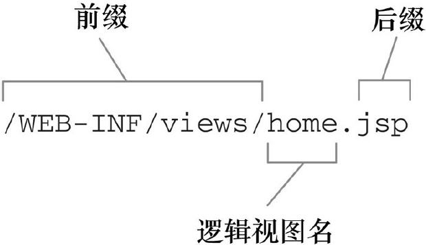

###Chapter 6 : 渲染Web视图

> 本章节主要介绍了Spring MVC中视图解析的配置, 以及三个较为常用的Web视图技术的部分内容

####1. _视图解析_
+ 将控制器中请求处理的逻辑和视图中的渲染实现解耦是Spring MVC的一个重要特性. 
+ Spring MVC定义了一个名为ViewResolver的接口
```java
public interface ViewResolver {
    View resolveViewName(String viewName, Locale locale)
                    throws Exception;
}
```

+ 当给resolveViewName()方法传入一个视图名和Locale对象时, 它会返回一个View实例. View接口的任务就是接受模型以及Servlet的request和response对象, 并将输出结果渲染到response中. 
```java
public interface View {
    String getContentType();
    void render(Map<String, ?> model,
    HttpServletRequest request,
    HttpServletResponse response) throws Exception;
}
```

+ 在Spring MVC中只需要实现ViewResolver和View, 就可满足视图解析功能, 而实际上Spring MVC提供了13种的内置实现, 因此只需要根据需求选择相对应的视图解析器就可以满足绝大多数应用场景. 

| 视图解析器                     | 描述                                                                                                                          |
|--------------------------------|-------------------------------------------------------------------------------------------------------------------------------|
| BeanNameViewResolver           | 将视图解析为Spring应用上下文中的bean, 其中bean的ID与视图的名字相同                                                            |
| ContentNegotiatingViewResolver | 通过考虑客户端需要的内容类型来解析视图, 委托给另外一个能够产生对应内容类型的视图解析器                                        |
| FreeMarkerViewResolver         | 将视图解析为FreeMarker模板                                                                                                    |
| **InternalResourceViewResolver**   | 将视图解析为Web应用的内部资源(一般为JSP)                                                                                    |
| JasperReportsViewResolver      | 将视图解析为JasperReports定义                                                                                                 |
| ResourceBundleViewResolver     | 将视图解析为资源bundle(一般为属性文件)                                                                                      |
| TilesViewResolver              | 将视图解析为Apache Tile定义, 其中tile ID与视图名称相同. 注意有两个不同的TilesViewResolver实现, 分别对应于Tiles 2.0和Tiles 3.0 |
| UrlBasedViewResolver           | 直接根据视图的名称解析视图, 视图的名称会匹配一个物理视图的定义                                                                |
| VelocityLayoutViewResolver     | 将视图解析为Velocity布局, 从不同的Velocity模板中组合页面                                                                      |
| VelocityViewResolver           | 将视图解析为Velocity模板                                                                                                      |
| XmlViewResolver                | 将视图解析为特定XML文件中的bean定义. 类似于BeanNameViewResolver                                                               |
| XsltViewResolver               | 将视图解析为XSLT转换后的结果                                                                                                  |

####2. _jsp相关_
+ Spring提供了两种支持JSP视图的方式
    + InternalResourceViewResolver会将视图名解析为JSP文件. 另外, 如果在你的JSP页面中使用了JSP标准标签库(JavaServer Pages Standard Tag Library, JSTL)的话, InternalResourceViewResolver能够将视图名解析为JstlView形式的JSP文件, 从而将JSTL本地化和资源bundle变量暴露给JSTL的格式化(formatting)和信息(message)标签. 
    + Spring提供了两个JSP标签库, 一个用于表单到模型的绑定, 另一个提供了通用的工具类特性. 
    
+ InternalResourceViewResolver
    + 遵循一种约定, 会在视图名上添加前缀和后缀, 进而确定一个Web应用中视图资源的物理路径. 
    + 示例图: 
    
    
    
    + 配置示例:
    ```java
    @Bean
    public ViewResolver viewResolver() {
        InternalResourceViewResolver resolver =
                      new InternalResourceViewResolver();
        resolver.setPrefix("/WEB-INF/views/");
        resolver.setSuffix(".jsp");
        return resolver;
    }
    ```
    
    ```xml
    <bean id="viewResolver"
          class="org.springframework.web.servlet.view.
                          InternalResourceViewResolver"
          p:prefix="/WEB-INF/views/"
          p:suffix=".jsp" />
    ```
    
    + 解析JSTL视图: 只需设置它的viewClass属性.
    ```java
    @Bean
    public ViewResolver viewResolver() {
      InternalResourceViewResolver resolver =
                       new InternalResourceViewResolver();
      resolver.setPrefix("/WEB-INF/views/");
      resolver.setSuffix(".jsp");
      resolver.setViewClass(
                  org.springframework.web.servlet.view.JstlView.class);
      return resolver;
    }
    ```
    
    ```xml
    <bean id="viewResolver"
          class="org.springframework.web.servlet.view.
                          InternalResourceViewResolver"
          p:prefix="/WEB-INF/views/"
          p:suffix=".jsp"
          p:viewClass="org.springframework.web.servlet.view.JstlView" />
    ```
    
+ Spring Form Tag Lib

| JSP标签             | 描述                                                                  |
|---------------------|-----------------------------------------------------------------------|
| \<sf:checkbox\>     | 渲染成一个HTML \<input\>标签, 其中type属性设置为checkbox              |
| \<sf:checkboxes\>   | 渲染成多个HTML\<input\> 标签, 其中type属性设置为checkbox              |
| \<sf:errors\>       | 在一个HTML\<span\> 中渲染输入域的错误                                 |
| \<sf:form\>         | 渲染成一个HTML\<form\> 标签, 并为其内部标签暴露绑定路径, 用于数据绑定 |
| \<sf:hidden\>       | 渲染成一个HTML\<input\> 标签, 其中type属性设置为hidden                |
| \<sf:input\>        | 渲染成一个HTML<input> 标签, 其中type属性设置为text                    |
| \<sf:label\>        | 渲染成一个HTML\<label\> 标签                                          |
| \<sf:option\>       | 渲染成一个HTML\<option\> 标签, 其selected属性根据所绑定的值进行设置   |
| \<sf:options\>      | 按照绑定的集合、数组或Map, 渲染成一个HTML\<option\> 标签的列表        |
| \<sf:password\>     | 渲染成一个HTML\<input\> 标签, 其中type属性设置为password              |
| \<sf:radiobutton\>  | 渲染成一个HTML\<input\> 标签, 其中type属性设置为radio                 |
| \<sf:radiobuttons\> | 渲染成多个HTML\<input\> 标签, 其中type属性设置为radio                 |
| \<sf:select\>       | 渲染为一个HTML\<select\> 标签                                         |
| \<sf:textarea\>     | 渲染为一个HTML\<textarea\> 标签要                                     |

+ Spring Tag Lib

| JSP标签             | 描述                                                                                                                                                                                                             |
|---------------------|------------------------------------------------------------------------------------------------------------------------------------------------------------------------------------------------------------------|
| \<s:bind\>          | 将绑定属性的状态导出到一个名为status的页面作用域属性中, 与\<s:path\>组合使用获取绑定属性的值                                                                                                                     |
| \<s:escapeBody\>    | 将标签体中的内容进行HTML和/或JavaScript转义                                                                                                                                                                      |
| \<s:hasBindErrors\> | 根据指定模型对象(在请求属性中)是否有绑定错误, 有条件地渲染内容                                                                                                                                                 |
| \<s:htmlEscape\>    | 为当前页面设置默认的HTML转义值                                                                                                                                                                                   |
| \<s:message\>       | 根据给定的编码获取信息, 然后要么进行渲染(默认行为), 要么将其设置为页面作用域、请求作用域、会话作用域或应用作用域的变量(通过使用var和scope属性实现)                                                           |
| \<s:nestedPath\>    | 设置嵌入式的path, 用于\<s:bind\>之中                                                                                                                                                                             |
| \<s:theme\>         | 根据给定的编码获取主题信息, 然后要么进行渲染(默认行为), 要么将其设置为页面作用域、请求作用域、会话作用域或应用作用域的变量(通过使用var和scope属性实现)                                                       |
| \<s:transform\>     | 使用命令对象的属性编辑器转换命令对象中不包含的属性                                                                                                                                                               |
| \<s:url\>           | 创建相对于上下文的URL, 支持URI模板变量以及HTML/XML/JavaScript转义. 可以渲染URL(默认行为), 也可以将其设置为页面作用域、请求作用域、会话作用域或应用作用域的变量(通过使用var和scope属性实现)                   |
| \<s:eval\>          | 计算符合Spring表达式语言(Spring Expression Language, SpEL)语法的某个表达式的值, 然后要么进行渲染(默认行为), 要么将其设置为页面作用域、请求作用域、会话作用域或应用作用域的变量(通过使用var和scope属性实现) |

+ \<s:message\>需要配合实现MessageSource接口的信息源类使用
    + ResourceBundleMessageSource类配置
    ```java
    @Bean
    public MessageSource messageSource() {
      ResourceBundleMessageSource messageSource =
              new ResourceBundleMessageSource();
      messageSource.setBasename("messages");
      return messageSource;
    }
    ```
    
    + ReloadableResourceBundleMessageSource类配置
    ```java
    @Bean
    public MessageSource messageSource() {
      ReloadableResourceBundleMessageSource messageSource =
              new ReloadableResourceBundleMessageSource();
      messageSource.setBasename("file:///etc/spittr/messages");
      messageSource.setCacheSeconds(10);
      return messageSource;
    }
    ```
    
    + ResourceBundleMessageSource与ReloadableResourceBundleMessageSource关键区别在于: 能够重新加载信息属性, 而不必重新编译或重启应用.

####3. _tiles相关_

> 总的来说这是一种布局引擎, 用于定义适应所有页面的通用布局.

+ 配置TilesConfigurer来解析Tile定义, 所要设置的最重要的属性就是definitions. 这个属性接受一个String类型的数组, 其中每个条目都指定一个Tile定义的XML文件. 
```java
@Bean
public TilesConfigurer tilesConfigurer() {
    TilesConfigurer tiles = new TilesConfigurer();
    tiles.setDefinitions(new String[] {
        "/WEB-INF/layout/tiles.xml",
        "/WEB-INF/**/tiles.xml"
    });
    tiles.setCheckRefresh(true);
    return tiles;
}
```

```xml
<bean id="tilesConfigurer" class=
        "org.springframework.web.servlet.view.tiles3.TilesConfigurer">
    <property name="definitions">
        <list>
            <value>/WEB-INF/layout/tiles.xml.xml</value>
            <value>/WEB-INF/views/**/tiles.xml</value>
        </list>
    </property>
</bean>
```

+ 配置TilesViewResolver.
```java
@Bean
public ViewResolver viewResolver() {
    return new TilesViewResolver();
}
```

```xml
<bean id="viewResolver" class=
    "org.springframework.web.servlet.view.tiles3.TilesViewResolver" />
```

+ 定义Tiles
```xml
<?xml version="1.0" encoding="ISO-8859-1" ?>
<!DOCTYPE tiles-definitions PUBLIC
        "-//Apache Software Foundation//DTD Tiles Configuration 3.0//EN"
        "http://tiles.apache.org/dtds/tiles-config_3_0.dtd">
<!--注意声明Apache Tiles的DTD-->
<tiles-definitions>
    <definition name="base"
                template="/WEB-INF/layout/page.jsp">
        <put-attribute name="header"
                value="/WEB-INF/layout/header.jsp" />
        <put-attribute name="footer"
                value="/WEB-INF/layout/footer.jsp" />
    </definition>
    <!--注意这里有extends属性, 这样可以继承base的配置, 同时增加部分配置-->
    <definition name="home" extends="base">
        <put-attribute name="body"
                value="/WEB-INF/views/home.jsp" />
    </definition>
    <definition name="registerForm" extends="base">
        <put-attribute name="body"
                value="/WEB-INF/views/registerForm.jsp" />
    </definition>
    <definition name="profile" extends="base">
        <put-attribute name="body"
                value="/WEB-INF/views/profile.jsp" />
    </definition>
    <definition name="spittles" extends="base">
        <put-attribute name="body"
                value="/WEB-INF/views/spittles.jsp" />
    </definition>
    <definition name="spittle" extends="base">
        <put-attribute name="body"
                value="/WEB-INF/views/spittle.jsp" />
</definition>
</tiles-definitions>
```

+ [定义Page.jsp作为基础页面]()
```html
<%@ taglib uri="http://www.springframework.org/tags" prefix="s" %>
<%@ taglib uri="http://tiles.apache.org/tags-tiles" prefix="t" %>
<%@ page session="false" %>
<html>
    <head>
        <title>Spittr</title>
        <link rel="stylesheet"
            type="text/css"
            href="<s:url value="/resources/style.css" />" >
    </head>
    <body>
        <div id="header">
            <t:insertAttribute name="header" />
        </div>
        <div id="content">
            <t:insertAttribute name="body" />
        </div>
        <div id="footer">
            <t:insertAttribute name="footer" />
        </div>
    </body>
</html>
```

+ org.springframework.web.servlet.view.tiles2与org.springframework.web.servlet.view.tiles3包中提供了相同的名称的TilesConfigurer/TilesViewResolver. 区别在于Tiles版本, 这取决于你的Spring支持版本.

####4. _thymeleaf相关_

> 个人感觉这是一个类似于Tag Lib整合的技术, 另外许多操作更偏向于前端, 不过网上搜了下他的性能很差很差, 适合于原型开发吧.

+ 配置Thymeleaf视图解析器
    + 配置ThymeleafViewResolver: 将逻辑视图名称解析为Thymeleaf模板视图.
    ```java
    @Bean
    public ViewResolver viewResolver(
          SpringTemplateEngine templateEngine) {
      ThymeleafViewResolver viewResolver = new ThymeleafViewResolver();
      viewResolver.setTemplateEngine(templateEngine);
      return viewResolver;
    }
    ```
    
    ```xml
    <bean id="viewResolver"
          class="org.thymeleaf.spring3.view.ThymeleafViewResolver"
          p:templateEngine-ref="templateEngine" />
    ```
    
    + 配置SpringTemplateEngine: 处理模板并渲染结果.
    ```java
    @Bean
    public TemplateEngine templateEngine(
          TemplateResolver templateResolver) {
      SpringTemplateEngine templateEngine = new SpringTemplateEngine();
      templateEngine.setTemplateResolver(templateResolver);
      return templateEngine;
    }
    ```
    
    ```xml
    <bean id="templateEngine"
          class="org.thymeleaf.spring3.SpringTemplateEngine"
          p:templateResolver-ref="templateResolver" />
    ```
    
    + TemplateResolver: 加载Thymeleaf模板.
    ```java
    @Bean
    public TemplateResolver templateResolver() {
          TemplateResolver templateResolver =
                      new ServletContextTemplateResolver();
      templateResolver.setPrefix("/WEB-INF/templates/");
      templateResolver.setSuffix(".html");
      templateResolver.setTemplateMode("HTML5");
      return templateResolver;
    }
    ```
    
    ```xml
    <bean id="templateResolver" class=
          "org.thymeleaf.templateresolver.ServletContextTemplateResolver"
          p:prefix="/WEB-INF/templates/"
          p:suffix=".html"
          p:templateMode="HTML5" />
    ```

+ 定义Thymeleaf模板. thymeleaf在很大程度上就是HTML文件, 与JSP不同, 它没有什么特殊的标签或标签库. Thymeleaf之所以能够发挥作用, 是因为它通过自定义的命名空间, 为标准的HTML标签集合添加Thymeleaf属性. **_[这里主要是学习各个标签的使用, 东西比较多, 不一一介绍, 想要系统学习就网上搜一搜, 反正完成Spring的配置后就可以正常支持了, 后面怎么用那是看实际生产环境.]()_**