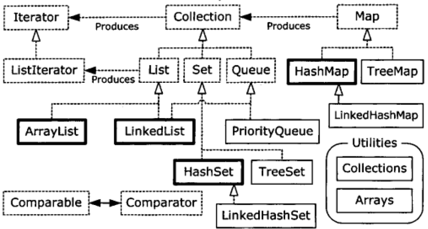

###Chapter 11 : Holding Your Objects (这一章是简单介绍容器类, 在后面会有一章节进行深入的介绍)
####1. _容器_
+ Java在java.util包中为我们提供了一组预置的容器类以供"保存一组对象", 不同于数组的定长, 容器类是不定长的可以自动扩容. 
+ 以下是它们的关系图: 

+ 如上容器类按照具体用途和用法, 划分为两种不同的概念
    + **Collection(接口)**: 一个独立元素的序列. 这些元素都服从一条或多条规则. 
        + **List(Collection的子接口)**: 按照插入顺序保存元素. 
        + **Set(Collection的子接口)**: 不能有重复元素. 
        + **Queue(Collection的子接口)**: 按照队列规则来确定对象产生的顺序. 
    + **Map(接口)**: 一组成对的"键值对"对象, 允许使用键来查找值. 映射表允许我们使用另一个对象查找某个对应对象. 因为是键相当于值的索引, 因此需要遵循[索引唯一]()原则. 
    
+ 类型安全容器: 通过类型约束可以在[编译时]()检查容器相关操作是否类型安全, 而不是在[运行时]()通过类型检查再报错. [需要注意的对于基础类型, 应该使用它们的包装类进行声明.]()
    > Collection<ClassName> collectinon = new ArrayList<ClassName>(); 
    > Map<ClassName> map = new HashMap<ClassName,ClassName>();

####2. _Collection接口_
+ 添加一组元素操作: 
    + _Collection.addAll()_: 这个方法相对Collections工具类提供的方法要简单一些.
    > boolean addAll(Collection<? extends E> c);
    
    + _Collections.addAll()_: 可以看到与上面的区别在于提供了一个可变输入参数, 方法相对更加灵活, [英文第4版说这个操作更快, 中文第四版说第一种方法更快, 一脸懵逼](). 
    > public static <T> boolean addAll(Collection<? super T> c, T... elements) 
    
    + 示例如下. 
    ```java
    class Snow{}
    class Powder extends Snow{}
    class Light extends Powder{}
    class Heavy extends Powder{}
    class Crusty extends Snow{}
    class Slush extends Snow{}
    public class AddingGroups {
        public static void main(String[] args) {
    
            // 注意这里新建一个ArrayList副本, 而不是直接使用原Array
            Collection<Integer> collection = new ArrayList<Integer>(Arrays.asList(1, 2, 3, 4, 5));
            Integer[] moreInts = {6, 7, 8, 9, 10};
    
            // 方法1
            collection.addAll(Arrays.asList(moreInts));
            // 方法2
            Collections.addAll(collection, 11, 12, 13, 14, 15);
            // 方法2
            Collections.addAll(collection, moreInts);
    
            // 这里直接使用原Array
            List<Integer> list = Arrays.asList(16, 17, 18, 19, 20);
            list.set(1, 21);
            // 这里因为Arrays.asList传回的List类底层仍然是Array类, 因此无法对其大小做出更改, 否则会报错, 具体看下面输出去. 
            //list.add(21);
          
            List<Snow> snow1 = Arrays.asList(
                    new Crusty(),
                    new Slush(),
                    new Powder()
            );
    
            //如果移除下面注释. 编译器会报错: Error:(50, 41) java: incompatible types: java.util.List<net.mindview.test.Powder> cannot be converted to java.util.List<net.mindview.test.Snow>
            //List<Snow> snows = Arrays.asList(
            //        new Light(),
            //        new Heavy()
            //);
    
            List<Snow> snows = new ArrayList<Snow>();
            Collections.addAll(snows, new Light(), new Heavy());
    
            List<Snow> snow4 = Arrays.<Snow>asList(
                    new Light(), new Heavy()
            );
        }
    }
    // 如果移除list.add(21);注释, 可以发现
    /* Output:
    Exception in thread "main" java.lang.UnsupportedOperationException
        at java.util.AbstractList.add(AbstractList.java:148)
        at java.util.AbstractList.add(AbstractList.java:108)
        at net.mindview.test.AddingGroups.main(AddingGroups.java:25)
        at sun.reflect.NativeMethodAccessorImpl.invoke0(Native Method)
        at sun.reflect.NativeMethodAccessorImpl.invoke(NativeMethodAccessorImpl.java:62)
        at sun.reflect.DelegatingMethodAccessorImpl.invoke(DelegatingMethodAccessorImpl.java:43)
        at java.lang.reflect.Method.invoke(Method.java:498)
        at com.intellij.rt.execution.application.AppMain.main(AppMain.java:147)
    */    
    // 注释最后一行
    /* Output: 顺利编译
    */
    ```
    
    + 上面示例中涉及到Arrays.asList()的一个问题: [方法返回的List类只是提供了List的接口方法, 但是底层仍然是Array类, 因此无法对其包装后的容器类进行大小变更, 否则会报 **UnsupportedOperationException** 运行时错误.]() 下面是官方方法注释说明. :bangbang:
    ```java
    /**
     * Returns a fixed-size list backed by the specified array.  (Changes to
     * the returned list "write through" to the array.)  This method acts
     * as bridge between array-based and collection-based APIs, in
     * combination with {@link Collection#toArray}.  The returned list is
     * serializable and implements {@link RandomAccess}.
     *
     * <p>This method also provides a convenient way to create a fixed-size
     * list initialized to contain several elements:
     * <pre>
     *     List&lt;String&gt; stooges = Arrays.asList("Larry", "Moe", "Curly");
     * </pre>
     *
     * @param <T> the class of the objects in the array
     * @param a the array by which the list will be backed
     * @return a list view of the specified array
     */
    ```
    
    + 另外一个问题是Arrays.asList()的类型推力问题: [Arrays.asList()必须要声明包装类型Arrays.<ClassName>asList(), 否则只能识别出当前Array类中的顶层类, 下面显示了具体错误.]() :bangbang:
    ```java
    // 下面的输出是在JDK1.6中报的错, 这个问题似乎在JDK1.8这个版本被修复了, 至少我用JDK1.8编译是没有问题的
    /*Output:
    Error:(50, 41) java: incompatible types: 
    java.util.List<net.mindview.test.Powder> 
    cannot be converted to java.util.List<net.mindview.test.Snow>
    */
    ```
    
    + [综合问题, 显然通过 **Collections.addAll()** 方法更加灵活方便.]() :heavy_exclamation_mark:
    
+ 打印操作: 所有原生的容器类都支持直接打印输出. 
    + 在 **AbstractCollection** 覆盖了Object的toString()方法. 用方括号包围, 逗号分割. 
    ```
    public String toString() {
        Iterator<E> it = iterator();
        if (! it.hasNext())
            return "[]";

        StringBuilder sb = new StringBuilder();
        sb.append('[');
        for (;;) {
            E e = it.next();
            sb.append(e == this ? "(this Collection)" : e);
            if (! it.hasNext())
                return sb.append(']').toString();
            sb.append(',').append(' ');
        }
    }
    ```
    
    + 在 **AbstractMap** 覆盖了Object的toString方法. 用大括号包围, 逗号分割. 
    ```
    public String toString() {
        Iterator<Entry<K,V>> i = entrySet().iterator();
        if (! i.hasNext())
            return "{}";

        StringBuilder sb = new StringBuilder();
        sb.append('{');
        for (;;) {
            Entry<K,V> e = i.next();
            K key = e.getKey();
            V value = e.getValue();
            sb.append(key   == this ? "(this Map)" : key);
            sb.append('=');
            sb.append(value == this ? "(this Map)" : value);
            if (! i.hasNext())
                return sb.append('}').toString();
            sb.append(',').append(' ');
        }
    }
    ```
    
    
####3. _List接口_
+ List接口下有两个实现类, 分别代表了两种不同的用途
    + ArrayList: 随机访问速度快, 但是在集合中部插入或删除操作相对较慢. 
    + LinkedList: 适合顺序访问, 随机访问速度较慢, 但是在集合中间插入或删除操作相对较快. 同时LinkedList相比ArrayList有更多的特有方法. 

+ 内置方法:  

|       方法名      | 描述                                                                           |
|:-----------------:|--------------------------------------------------------------------------------|
| **contains**      | 通过对象内置的 **equals()** 方法判断对象是否在集合内.                          |
| **containsAll**   | 判断一个集合是否在当前集合内, 只是判断是否存在, 所以顺序并不重要.              |
| **remove**        | 移除对象.                                                                      |
| **removeAll**     | 移除调用方法存在的对象.                                                        |
| **indexOf**       | 返回对象下标.                                                                  |
| **subList**       | 返回集合的子集.                                                                |
| [**retainAll**]() | 交集操作, 在调用方法的集合中只保留两个集合之间的交集. :heavy_exclamation_mark: |
| **set**           | 设置指定下标的对象.                                                            |
| **add**           | 按照List的顺序, 添加对象到集合尾部.                                            |
| **addAll**        | 添加全部对象到当前集合. 这个方法有重载, 支持从指定下标位置开始插入.            |
| **isEmpty**       | 判断集合是否为空.                                                              |
| **clear**         | 清空当前集合.                                                                  |
| **toArray**       | 将当前集合转为Array类.                                                         |
    
+ [java.util.List.subList时最好小心点.]() :bangbang:
    + 它返回原来list的从(fromIndex, toIndex)之间这一部分的视图, 之所以说是视图, 是因为实际上, 返回的list是靠原来的list支持的. 所以, 你对原来的list和返回的list做的"非结构性修改"(non-structural changes), 都会影响到彼此对方. 所谓的"非结构性修改", 是指不涉及到list的大小改变的修改. 相反, 结构性修改, 指改变了list大小的修改.
    + [如果发生结构性修改的是返回的子list, 那么原来的list的大小也会发生变化.]()
    + [而如果发生结构性修改的是原来的list(不包括由于返回的子list导致的改变), 那么返回的子list语义上将会是undefined. 在AbstractList(ArrayList的父类)中, undefined的具体表现形式是抛出一个ConcurrentModificationException.]()
    + 官方文档 
    ```java
    /**
    * Returns a view of the portion of this list between the specified
    * {@code fromIndex}, inclusive, and {@code toIndex}, exclusive.  (If
    * {@code fromIndex} and {@code toIndex} are equal, the returned list is
    * empty.)  The returned list is backed by this list, so non-structural
    * changes in the returned list are reflected in this list, and vice-versa.
    * The returned list supports all of the optional list operations.
    *
    * <p>This method eliminates the need for explicit range operations (of
    * the sort that commonly exist for arrays).  Any operation that expects
    * a list can be used as a range operation by passing a subList view
    * instead of a whole list.  For example, the following idiom
    * removes a range of elements from a list:
    * <pre>
    *      list.subList(from, to).clear();
    * </pre>
    * Similar idioms may be constructed for {@link #indexOf(Object)} and
    * {@link #lastIndexOf(Object)}, and all of the algorithms in the
    * {@link Collections} class can be applied to a subList.
    *
    * <p>The semantics of the list returned by this method become undefined if
    * the backing list (i.e., this list) is <i>structurally modified</i> in
    * any way other than via the returned list.  (Structural modifications are
    * those that change the size of this list, or otherwise perturb it in such
    * a fashion that iterations in progress may yield incorrect results.)
    *
    * @throws IndexOutOfBoundsException {@inheritDoc}
    * @throws IllegalArgumentException {@inheritDoc}
    */
    ```
    
    + 示例: 
    ```java
    public class SubListTest {
        public static void main(String[] args) {
            List<Integer> list1 = new ArrayList<Integer>();
            list1.add(1);list1.add(2);list1.add(3);
            list1.add(4);list1.add(5);list1.add(6);
            list1.add(7);list1.add(8);list1.add(9);
            List<Integer> subList = list1.subList(3,6);
    
            System.out.println(list1);
            System.out.println(subList);
    
            Collections.reverse(list1);
            System.out.println(list1);
            System.out.println(subList);
    
            Collections.shuffle(list1);
            System.out.println(list1);
            System.out.println(subList);
    
            subList.remove(0);
            System.out.println(list1);
            System.out.println(subList);
              
            // 这里会报错, 看下面的输出结果
            list1.remove(2);
            System.out.println(list1);
            System.out.println(subList);
    
        }
    }
  
    /*Output:
    [1, 2, 3, 4, 5, 6, 7, 8, 9]
    [4, 5, 6]
    [9, 8, 7, 6, 5, 4, 3, 2, 1]
    [6, 5, 4]
    [9, 4, 3, 8, 6, 5, 2, 7, 1]
    [8, 6, 5]
    [9, 4, 3, 6, 5, 2, 7, 1]
    [6, 5]
    [9, 4, 6, 5, 2, 7, 1]
    java.util.ConcurrentModificationException
    	at java.util.ArrayList$SubList.checkForComodification(ArrayList.java:1231)
    	at java.util.ArrayList$SubList.listIterator(ArrayList.java:1091)
    	at java.util.AbstractList.listIterator(AbstractList.java:299)
    	at java.util.ArrayList$SubList.iterator(ArrayList.java:1087)
    	at java.util.AbstractCollection.toString(AbstractCollection.java:454)
  	    ......
    */
    ```
    
####4. _ Iterator接口_
+ 迭代器用来进一步对容器类遍历操作进行解耦的, 遵循的是迭代设计模式, 这个在第9章笔记中有介绍, 就不详细介绍. 
+ 所有实现Collection接口的具体类都提供了返回对象迭代器的方法: [containerObjectName.iterator()](), 这个方法会过匿名内部类返回实现Iterator接口的迭代器.
+ Iterator存在一定的约束性: [只能按照一个方向进行迭代输出](), 这个显然不如自己手动写foreach之类的灵活. 
+ 基本方法:  

|    方法名   | 描述                                                                                          |
|:-----------:|-----------------------------------------------------------------------------------------------|
| **next**    | 指针移动到下一个, 并返回指向对象.                                                             |
| **hasNext** | 判断是否到集合的尾部.                                                                         |
| **remove**  | [这个是可选方法, 也就是实现类可以不必实现, 毕竟我感觉迭代器主要是用来读取的不是用来增删的.]() |

####5. [_ListIterator接口_]() :heavy_exclamation_mark:
+ 所有List实现类都提供了一种叫做ListIterator的迭代器, 通过listIterator()方法获得, [优势是支持双向迭代.]()
+ 额外方法:  

|       方法名      | 描述                              |
|:-----------------:|-----------------------------------|
| **previous**      | 移动到上一个位置, 并返回指向对象. |
| **previousIndex** | 返回上一处索引.                   |
| **nextIndex**     | 返回上一次next操作后的指向索引.   |
+ 没来得及看源码, 应该是有两个本地变量, 一个保存next操作后来的指针位置, 一个保存previous操作后的指针位置, 一个是++操作, 一个是--操作. 

####6. _LinkedList类_
+ LinkedList除了在增删查操作上存在性能差别外, [更大的区别是LinkedList提供了大量的内置方法, 这使得它可以被当做是栈Stack或者队列Queue使用]().
+ 额外方法:  

|          方法名           | 描述                                                                                    |
|:-------------------------:|-----------------------------------------------------------------------------------------|
| **getFirst, element**     | 返回且不移除集合头部元素值, 不存在则报错 **NoSuchElementException**, 完全相同操作.      |
| **peek**                  | 返回集合头部元素值, 不存在则返回null, 这个是用于队列操作的. 与上面的唯一区别是不会报错. |
| **removeFirst, remove**   | 与 **getFirst(),element()** 相同, 唯一区别是会从集合中删除集合头部元素.                 |
| **poll**                  | 与 **peek()** 相同, 只是会删除元素.                                                     |
| **add, addLast**          | 相同操作, 在集合尾部添加元素.                                                           |
| **offer**                 | 与上面完全相同, 却别在于该命名方法一般用于队列操作.                                     |
| **addFirst**              | 集合头部添加元素.                                                                       |
| **removeLast**            | 集合尾部删除元素.                                                                       |
    
+ [通过上面方法可以发现LinkedList除实现了Queue接口的所有方法, 因此可以直接转型为Queue接口类.]()

####7. _Stack类_
+ 一种后先出队列, Java在最早期版本内置了一个糟糕的Stack类继承自Vector接口, 因为设计糟糕, 本书作者不推荐使用. 
+ [作者推荐直接把LinkedList当做Stack使用, 如果想要语义清楚, 可以自己自定义一个Stack类包装LinkedList, 而不要使用Java内置的Stack类.]() :heavy_exclamation_mark:
+ 接口一般在编程语言中被用于评估表达式: 这个做一下[练习15](exercises/exercise15).

####8. _Set接口_
+ Set继承自Collection接口, 因此其实现类同样支持Collection的所有操作, 其与List接口的最主要区别在于: [集合中元素保证不重复](). 该特性主要通过计算对象的哈希值进行判断. 
+ 通过源代码, 可以发现Set与Collection接口是相等的, 这里重写了一个接口主要是想通过其名称表明其元素唯一的特性. 这也是一种设计理念. 
+ 内置实现类: 
    + HashSet: 通过Hash表实现, 查询效率最高, 但是其元素的保存顺序不可控不可预测. 
    + TreeSet: 以红黑树数据结构保存元素, 因此顺序是可预测可控的. 
    + LinkedHashSet: 既保留了HashSet的有点, 也使得元素的顺序可预测可控, 但是肯定牺牲了插入速度. 
+ Set类最常用于判断包含关系, [因为这是一个查询操作, 因此对速度要求是首要的, 所以通过Hash表实现的HsshSet类是最推崇的]().

####9. _Map接口_
+ 是与Collection独立的接口, 因此与上面的所有类没有继承实现关系,  保存的是一组<key-value>, <key-value>指的是一对存在映射关系的对象, 实际使用中较为常用. 
+ Map类没有提供了迭代器, 因此无法直接使用foreach进行循环, 但是提供了entrySet()方法, 用于返回包装了所有<key-value>的Set, 因此该集合可返回迭代器. 
+ 基本方法:   

|       方法名      | 描述                             |
|:-----------------:|----------------------------------|
| **keySet**        | 返回键的Set, 因为元素不可重复.   |
| **valueSet**      | 返回Collection类, 元素可重复.    |
| **entrySet**      | 返回键值对Set, 属于Collection类. |
| **containsKey**   | 判断该键是否存在.                |
| **contiansValue** | 判断该值是否存在.                |

####10. _Queue接口_
+ [一种先进先出集合, 常常被用于安全地将一个任务传给另一个任务.]()
+ 可以直接把LinkedList转型为Queue. 
+ _**PriorityQueue类**_: 不同于先进先出队列, 该类是按照优先级出队的, 也就是当前队列中最重要的元素优先出队, 优先级判断有的实现方式是在插入时判断然后调整顺序, 有的是在出队时判断. 
+ [默认的顺序是按照自然顺序排列, 但是可以通过传入自定义比较器, 从而实现自定义优先级.]()
    > new PriorityQueue<T>(int length,Comparator comparatorClass)

####11. _Collection vs. Iterator_
+ Collection和Iterator的子类都是支持foreach迭代输出的, 但是如果你想实现一个可以被foreach迭代的类时, 需要考虑应该如何操作. 
    + 如果仅仅需要迭代功能, 通过返回一个迭代器更加高效简单. [这种操作耦合性是最低的.]()
    + 如果实现类需要一些容器类的操作, 则实现Collection类可能更适合. 
+ 事实上, 实现Collection接口时需要强制实现一个提供迭代器的方法. 
+ [Java中规定实现了Iterable接口的类提供Iterator迭代器, 因此只需要实现Iterable接口就可以了,]()
+ [Java中可以被foreach迭代的有两种: 1.实现Iterable接口的类, 2.Array(注意数组并没有实现Iterable接口, 但是可以被foreach使用).]()

####12. _额外的注意点_
+ 本章介绍容器类较为浅显, 虽然也涉及到一些细节, 但是更多的是介绍用法, 更深入的介绍请看[chapter17](../chapter17).
+ [通过Arrays转化的集合都有一个显著的特点: 它们的底层实现仍然是Array, 因此有了一些特别的约束, 比如不能增删操作, 这里需要特别注意.]() :bangbang: